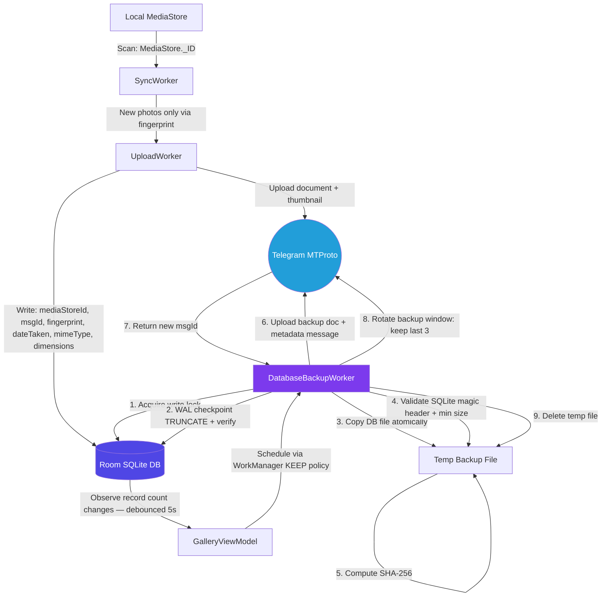

# TGPix — Backup Strategy Production Review
### Critical Issues, Improvements & Production Hardening

> **How to read this document:**
> - 🔴 **Critical** — Will cause data loss, corruption, or crashes in production. Fix before first release.
> - 🟡 **Important** — Will cause user-facing bugs or degraded reliability under real conditions. Fix before v1 stable.
> - 🟢 **Improvement** — Production hardening, performance, or maintainability gain. Recommended but not blocking.

---

## Table of Contents

1. [Critical Issues](#1-critical-issues)
2. [Important Issues](#2-important-issues)
3. [Schema Improvements](#3-schema-improvements)
4. [Backup Pipeline Hardening](#4-backup-pipeline-hardening)
5. [Restore Pipeline Hardening](#5-restore-pipeline-hardening)
6. [Upload Worker Hardening](#6-upload-worker-hardening)
7. [Security Hardening](#7-security-hardening)
8. [Missing Production Concerns](#8-missing-production-concerns)
9. [Pre-Launch Checklist Additions](#9-pre-launch-checklist-additions)
10. [Revised Architecture Diagram](#10-revised-architecture-diagram)

---

## 1. Critical Issues

### 🔴 C1 — `fallbackToDestructiveMigration()` is a Data Nuke in Production

**What the document says:**
```kotlin
Room.databaseBuilder(...)
    .addMigrations(MIGRATION_2_3, ...)
    .fallbackToDestructiveMigration()
    .build()
```

**Why this is critical:**
This is the single most dangerous line in the entire codebase. If ANY user skips a version (e.g., installs v1, skips v2, installs v3 directly) and a migration path is not defined between v1→v3, Room silently wipes their entire local database — `uploads`, `cloud_photos`, `albums`, `album_photos` — all gone with no warning to the user.

The document acknowledges this risk but leaves it in place. That is not acceptable for production.

**Fix:**

Remove `fallbackToDestructiveMigration()` entirely. Replace with a safe fallback that notifies the user:

```kotlin
Room.databaseBuilder(context, UploadDatabase::class.java, "upload_database")
    .addMigrations(
        MIGRATION_1_2,   // add this — see C2
        MIGRATION_2_3,
        MIGRATION_3_4,
        MIGRATION_4_5,
        MIGRATION_5_6
    )
    .addCallback(object : RoomDatabase.Callback() {
        override fun onDestructiveMigration(db: SupportSQLiteDatabase) {
            // This should NEVER be reached if all migrations are defined
            // Log it as a fatal event and alert the user
            FirebaseCrashlytics.getInstance()
                .recordException(IllegalStateException("Destructive migration executed on DB version"))
        }
    })
    // DO NOT call .fallbackToDestructiveMigration()
    .build()
```

If a migration is genuinely impossible to write (schema is unrecoverable), trigger the **Restore Workflow** instead of silent destruction — download the backup from Telegram, restore it, and inform the user.

---

### 🔴 C2 — Version 1 → 2 Migration is Destructive With No Path Defined

**What the document says:**
```
v1 --> v2 : Automatic / Destructive
```

**Why this is critical:**
There is no `MIGRATION_1_2` defined. Any user still on v1 (or a fresh install that starts at v1 schema) who updates will hit the destructive fallback. Given `fallbackToDestructiveMigration()` is enabled, this silently wipes their database.

**Fix:**

Even if the v1 schema was fundamentally different, define the migration explicitly. If the schema change was too breaking, at minimum trigger the Telegram restore flow:

```kotlin
val MIGRATION_1_2 = object : Migration(1, 2) {
    override fun migrate(db: SupportSQLiteDatabase) {
        // If schema was completely different, recreate tables
        // and schedule a restore from Telegram backup
        db.execSQL("DROP TABLE IF EXISTS `old_table_name`")
        db.execSQL("""
            CREATE TABLE IF NOT EXISTS `cloud_photos` (
                `messageId` INTEGER PRIMARY KEY NOT NULL,
                ...
            )
        """)
        // Set a flag in SharedPreferences to trigger restore on next app open
    }
}
```

---

### 🔴 C3 — Backup Triggered Directly from a `LaunchedEffect` in the UI Layer

**What the document says:**
```kotlin
// In PhotosGridScreen.kt
LaunchedEffect(totalRecords) {
    if (totalRecords != lastBackupCount) {
        BackupManager.backupDatabase(context)
    }
}
```

**Why this is critical:**
This is triggering a network-bound database backup operation (WAL flush + file copy + Telegram upload) directly from a Composable's `LaunchedEffect`. This means:

1. **It runs on the main thread scope** unless `BackupManager` internally dispatches to IO — a race condition waiting to happen.
2. **The UI is driving infrastructure** — a Compose recomposition, a screen rotation, or a rapid state change can fire multiple concurrent backup attempts.
3. **No backpressure** — if photos are added rapidly, this fires on every count change with no debounce.
4. **Screen lifecycle** — if the user navigates away from `PhotosGridScreen`, the `LaunchedEffect` is cancelled mid-backup, leaving an incomplete upload with no retry.

**Fix:**

Move backup triggering entirely out of the UI layer. Use a `WorkManager` `PeriodicWorkRequest` or observe DB changes in a `Repository` layer:

```kotlin
// In BackupRepository.kt or a dedicated BackupScheduler
class BackupScheduler @Inject constructor(
    private val workManager: WorkManager,
    private val prefsManager: PreferencesManager
) {
    fun scheduleBackupIfNeeded(currentCount: Int) {
        val lastCount = prefsManager.getLastBackupRecordCount()
        if (currentCount > lastCount) {
            val request = OneTimeWorkRequestBuilder<DatabaseBackupWorker>()
                .setConstraints(
                    Constraints.Builder()
                        .setRequiredNetworkType(NetworkType.CONNECTED)
                        .build()
                )
                .setBackoffCriteria(BackoffPolicy.EXPONENTIAL, 30, TimeUnit.SECONDS)
                .build()
            workManager.enqueueUniqueWork(
                "db_backup",
                ExistingWorkPolicy.KEEP,  // don't re-enqueue if already running
                request
            )
        }
    }
}
```

Observe DB count changes in the ViewModel, not the screen:

```kotlin
// In GalleryViewModel
init {
    viewModelScope.launch {
        repository.observeTotalRecordCount()
            .debounce(5000L)  // wait 5s after last change before triggering
            .collect { count ->
                backupScheduler.scheduleBackupIfNeeded(count)
            }
    }
}
```

---

### 🔴 C4 — Database Binary Copy Without Exclusive Lock

**What the document says:**
```kotlin
db.openHelper.writableDatabase.execSQL("PRAGMA wal_checkpoint(FULL)")
// ... then copies file
FileInputStream(downloadedFile).use { input ->
    FileOutputStream(dbFile).use { output ->
        input.copyTo(output)
    }
}
```

**Why this is critical:**
Between the WAL checkpoint and the file copy, another thread (the UploadWorker, a DAO write from a Coroutine) could write new data to the database. The resulting backup file would be inconsistent — the WAL was flushed but new changes occurred before the copy completed.

**Fix:**

Use SQLite's built-in `sqlite3_backup` API via `VACUUM INTO` (API 33+ safe) or hold an exclusive lock during the copy window:

```kotlin
suspend fun backupDatabaseSafely(context: Context) = withContext(Dispatchers.IO) {
    val db = UploadDatabase.getInstance(context)

    // Pause all writes by acquiring write lock
    db.runInTransaction {
        // WAL checkpoint inside the transaction — atomic
        db.openHelper.writableDatabase.execSQL("PRAGMA wal_checkpoint(TRUNCATE)")

        val sourceFile = context.getDatabasePath("upload_database")
        val backupFile = File(context.cacheDir, "tgpix_backup_${System.currentTimeMillis()}.db")

        // Copy while write lock is held — no concurrent writes possible
        sourceFile.copyTo(backupFile, overwrite = true)

        // Compute checksum on the locked-consistent copy
        val checksum = computeSha256(backupFile)

        // Return both for upload
        Pair(backupFile, checksum)
    }.let { (backupFile, checksum) ->
        // Upload outside the transaction — lock released, DB is live again
        uploadToTelegram(backupFile, checksum)
        backupFile.delete()
    }
}
```

---

## 2. Important Issues

### 🟡 I1 — `uploads` Table Uses File Path as Primary Key — Will Break

**What the document says:**
```
Primary Key: path (String) — Absolute Android file URI/path of the local media file.
```

**Why this is a problem:**
Android file paths are **not stable identifiers**. They change when:
- The user moves a photo to a different folder
- The app is reinstalled (scoped storage path changes)
- The photo is edited and saved as a new file
- MediaStore assigns a new URI after a system update

If the path changes, the row is orphaned in `uploads` but the photo is re-uploaded to Telegram, creating a **duplicate in the cloud**.

**Fix:**

Use `MediaStore._ID` (a stable Long) as the primary key, supplemented by the `contentFingerprint` as a deduplication guard:

```kotlin
@Entity(tableName = "uploads")
data class UploadEntity(
    @PrimaryKey val mediaStoreId: Long,       // stable MediaStore._ID
    val path: String,                          // for display only, not keyed
    val contentFingerprint: String,            // "name_size_dateTaken" dedup key
    val uploadedAt: Long,
    val telegramMessageId: Long                // link back to cloud_photos
)
```

Also add a UNIQUE constraint on `contentFingerprint` to prevent duplicates at the DB level:

```sql
CREATE UNIQUE INDEX IF NOT EXISTS idx_uploads_fingerprint 
ON uploads(contentFingerprint);
```

---

### 🟡 I2 — `telegramFileId` is Volatile — Do Not Store It Long-Term

**What the document says:**
```
telegramFileId | INTEGER | No | File reference ID in the current TDLib instance (volatile).
```

The document correctly notes it is volatile, but the column is still `NOT NULL` and stored persistently. The risk is that code elsewhere will read this stale `fileId` and pass it to `DownloadFile()`, which will silently fail or return a wrong file on a new TDLib session.

**Fix:**

Mark it nullable with a default of `NULL`, and add a staleness flag:

```kotlin
@ColumnInfo(name = "telegramFileId") val telegramFileId: Long?,
@ColumnInfo(name = "fileIdCachedAt") val fileIdCachedAt: Long?,  // epoch ms
```

Add a helper to check if the cached file ID is still likely valid (TDLib sessions typically invalidate file IDs after restart):

```kotlin
fun isFileIdFresh(): Boolean {
    val age = System.currentTimeMillis() - (fileIdCachedAt ?: 0)
    return age < 30 * 60 * 1000L  // treat as stale after 30 min
}
```

When `isFileIdFresh()` is false, call `TdApi.GetMessage(chatId, messageId)` to refresh the file ID before any download.

---

### 🟡 I3 — `contentFingerprint` Formula is Weak for Deduplication

**What the document says:**
```
contentFingerprint = "${fileName}_${fileSize}_${uploadedAt}"
```

**Why this is a problem:**

`uploadedAt` is the time the upload completed — not the time the photo was taken. Two devices uploading the same photo at different times will generate different fingerprints and both will upload the same photo to Telegram as duplicates.

**Fix:**

Use `dateTaken` from MediaStore (the EXIF capture time), not `uploadedAt`:

```kotlin
val fingerprint = "${fileName}_${fileSize}_${photo.dateTaken}"
```

For extra robustness, compute a partial content hash of the first 64KB of the file:

```kotlin
fun computeFingerprint(file: File, dateTaken: Long): String {
    val partialHash = file.inputStream().use { stream ->
        val buffer = ByteArray(65536)  // 64KB
        val bytesRead = stream.read(buffer)
        MessageDigest.getInstance("MD5")
            .digest(buffer.copyOf(bytesRead))
            .toHex()
    }
    return "${file.name}_${file.length()}_${dateTaken}_${partialHash}"
}
```

This prevents false positives (two different photos with same name and size) and false negatives (same photo, different upload time).

---

### 🟡 I4 — Single Old Message Pruned — No Versioned Backup History

**What the document says:**
The backup pipeline keeps only the latest backup message and deletes the previous one immediately after a successful upload.

**Why this is a problem:**
If the new backup upload succeeds (message sent) but the Telegram file is corrupted or the app crashes during the restore, the old backup is already deleted. The user is left with one backup that may be broken.

**Fix:**

Keep the **last 3 backups** as a rolling window. Only prune the oldest when a 4th is successfully uploaded:

```kotlin
// In PreferencesManager — store a list of backup message IDs
fun getBackupMessageIds(): ArrayDeque<Long>  // ordered oldest → newest
fun saveBackupMessageId(msgId: Long) {
    val ids = getBackupMessageIds()
    ids.addLast(msgId)
    if (ids.size > 3) {
        val oldestId = ids.removeFirst()
        // Delete this one from Telegram
        pruneBackupMessage(oldestId)
    }
    persistIds(ids)
}
```

---

### 🟡 I5 — 5-Second Fixed Delay is Both Too Slow and Too Fast

**What the document says:**
```kotlin
// Mandatory 5-second delay after every single upload
delay(5000)
```

**Why this is a problem:**

- For 1 lakh photos: `100,000 × 5s = 500,000 seconds = ~5.8 days` of upload time. That is unacceptable.
- Flood wait limits are not linear — Telegram uses burst limits, not per-message rate limits. The actual safe rate for user accounts is roughly 1 message/second sustained with bursts allowed.
- A fixed delay doesn't respond to actual `FLOOD_WAIT` errors.

**Fix:**

Remove the fixed delay. Use adaptive throttling based on actual Telegram responses:

```kotlin
suspend fun uploadWithAdaptiveThrottle(filePath: String, chatId: Long) {
    var retryCount = 0
    while (true) {
        try {
            val result = telegramRepository.uploadDocument(filePath, chatId)
            // Success — no delay needed, proceed immediately
            consecutiveSuccessCount++
            if (consecutiveSuccessCount > 10) {
                // Sustained success — trust the burst allowance
                delay(500L)  // light courtesy delay only
            }
            return result
        } catch (e: TelegramFloodWaitException) {
            val waitSeconds = e.waitSeconds
            Log.w("Upload", "FLOOD_WAIT for ${waitSeconds}s")
            delay((waitSeconds + 2) * 1000L)  // respect exact wait + 2s buffer
            retryCount++
            if (retryCount > 5) throw e  // give up after 5 flood waits
        }
    }
}
```

Also parse `FLOOD_WAIT_X` from `TdApi.Error.message`:

```kotlin
fun parseFloodWait(error: TdApi.Error): Int? {
    return if (error.code == 420) {
        Regex("FLOOD_WAIT_(\\d+)").find(error.message)?.groupValues?.get(1)?.toInt()
    } else null
}
```

---

### 🟡 I6 — `album_photos.photoUri` is Ambiguous — Local Path or Remote ID?

**What the document says:**
```
photoUri (PK) | TEXT | Local path or Cloud unique remote ID
```

A column that holds **either** a local path or a remote ID depending on context is a schema design smell. It means query logic must guess which type it is, and joins are impossible.

**Fix:**

Split into two explicit nullable columns:

```kotlin
@Entity(
    tableName = "album_photos",
    primaryKeys = ["albumId", "cloudPhotoMessageId"]
)
data class AlbumPhotoEntity(
    val albumId: Long,
    val cloudPhotoMessageId: Long,  // FK → cloud_photos.messageId
)
```

Since all photos in an album must be backed up (they came from `cloud_photos`), using `messageId` as the reference is clean, unambiguous, and enables proper joins:

```sql
SELECT cp.* FROM cloud_photos cp
INNER JOIN album_photos ap ON cp.messageId = ap.cloudPhotoMessageId
WHERE ap.albumId = :albumId
ORDER BY cp.uploadedAt DESC
```

---

## 3. Schema Improvements

### 🟢 S1 — Add Missing Indexes

None of the tables have explicit indexes defined. For 1 lakh rows, unindexed queries on `cloud_photos` will perform full table scans.

Add these indexes in Room via `@Entity(indices = [...])`:

```kotlin
@Entity(
    tableName = "cloud_photos",
    indices = [
        Index(value = ["uploadedAt"]),          // timeline sort
        Index(value = ["contentFingerprint"], unique = true),  // dedup lookup
        Index(value = ["uniqueRemoteId"], unique = true),       // TDLib refresh
        Index(value = ["fileName"])             // search
    ]
)

@Entity(
    tableName = "uploads",
    indices = [
        Index(value = ["contentFingerprint"], unique = true),
        Index(value = ["mediaStoreId"], unique = true)
    ]
)

@Entity(
    tableName = "album_photos",
    indices = [
        Index(value = ["cloudPhotoMessageId"])  // reverse lookup: which albums contain this photo
    ]
)
```

---

### 🟢 S2 — Add `dateTaken` Column to `cloud_photos`

The `uploadedAt` field records when the upload happened, not when the photo was taken. Google Photos groups by **capture date**, not upload date. Without `dateTaken`, your timeline grouping will be wrong for old photos uploaded late.

```sql
ALTER TABLE cloud_photos ADD COLUMN dateTaken INTEGER NOT NULL DEFAULT 0;
```

Migration:
```kotlin
val MIGRATION_6_7 = object : Migration(6, 7) {
    override fun migrate(db: SupportSQLiteDatabase) {
        db.execSQL("ALTER TABLE cloud_photos ADD COLUMN dateTaken INTEGER NOT NULL DEFAULT 0")
    }
}
```

---

### 🟢 S3 — Add `mimeType` Column to `cloud_photos`

Without MIME type stored, you cannot differentiate photos from videos in the gallery without re-fetching from Telegram. This will cause incorrect UI rendering when video support is added.

```sql
ALTER TABLE cloud_photos ADD COLUMN mimeType TEXT NOT NULL DEFAULT 'image/jpeg';
```

---

### 🟢 S4 — Add `width` and `height` to `cloud_photos`

Without dimensions stored locally, Coil cannot pre-size image requests and must wait for the first decode to know the aspect ratio. This causes layout jumps in the grid.

```sql
ALTER TABLE cloud_photos ADD COLUMN width INTEGER NOT NULL DEFAULT 0;
ALTER TABLE cloud_photos ADD COLUMN height INTEGER NOT NULL DEFAULT 0;
```

---

### 🟢 S5 — `albums` Table Missing `coverPhotoMessageId`

Every album needs a cover photo for the Albums screen. Without it, the UI will default to the first photo in the join query, which changes non-deterministically.

```sql
ALTER TABLE albums ADD COLUMN coverPhotoMessageId INTEGER;
```

---

## 4. Backup Pipeline Hardening

### 🟢 B1 — Use `PRAGMA wal_checkpoint(TRUNCATE)` Not `FULL`

`PRAGMA wal_checkpoint(FULL)` returns even if not all WAL frames were checkpointed (e.g., if a read transaction is blocking). `TRUNCATE` also resets the WAL file size to zero after checkpointing, giving you a cleaner copy and smaller backup file.

```kotlin
db.openHelper.writableDatabase.execSQL("PRAGMA wal_checkpoint(TRUNCATE)")
```

Check the return values to confirm checkpoint succeeded:

```kotlin
val cursor = db.openHelper.writableDatabase.rawQuery("PRAGMA wal_checkpoint(TRUNCATE)", null)
cursor.use {
    if (it.moveToFirst()) {
        val busy = it.getInt(0)   // 0 = not blocked
        val log = it.getInt(1)    // total WAL frames
        val checkpointed = it.getInt(2)  // frames written to DB
        if (busy != 0 || log != checkpointed) {
            throw IOException("WAL checkpoint incomplete: busy=$busy log=$log checkpointed=$checkpointed")
        }
    }
}
```

---

### 🟢 B2 — Embed Backup Version in the Caption

If you ever change the DB schema significantly, an old backup restored on a newer app could fail silently. Include the DB version in the caption:

```
TGPix SQLite Database Backup #tgpix_backup v6 sha256:<hash> records:<count>
```

On restore, parse the version and run Room migrations on the restored file if needed before opening it.

---

### 🟢 B3 — Backup File Should Be Named With Timestamp

Currently the backup is always named `tgpix_backup.db`. If you ever keep multiple backup versions (see I4), you need to distinguish them.

```kotlin
val timestamp = SimpleDateFormat("yyyyMMdd_HHmmss", Locale.US).format(Date())
val backupFile = File(context.cacheDir, "tgpix_backup_${timestamp}.db")
```

---

### 🟢 B4 — Add Backup Size Guard

Before uploading, validate the backup file is not suspiciously small:

```kotlin
val MIN_EXPECTED_BACKUP_BYTES = 8192L  // 8KB minimum for a valid SQLite file

if (backupFile.length() < MIN_EXPECTED_BACKUP_BYTES) {
    throw IOException("Backup file too small (${backupFile.length()} bytes) — aborting to protect remote backup")
}

// Also validate it's a valid SQLite file by checking the magic header
val header = ByteArray(16)
backupFile.inputStream().use { it.read(header) }
val sqliteMagic = "SQLite format 3\u0000"
if (!String(header).startsWith("SQLite format 3")) {
    throw IOException("Backup file is not a valid SQLite database")
}
```

---

## 5. Restore Pipeline Hardening

### 🟢 R1 — Validate Restored DB Schema Version Before Opening

After copying the downloaded `.db` file but before calling `UploadDatabase.getDatabase(context)`, check that the schema version in the file matches what Room expects. Mismatched versions will cause Room to attempt migration on a corrupted state.

```kotlin
fun getSchemaVersionFromFile(dbFile: File): Int {
    // SQLite stores user_version at byte offset 60 (4 bytes, big-endian)
    val bytes = ByteArray(4)
    RandomAccessFile(dbFile, "r").use { raf ->
        raf.seek(60)
        raf.readFully(bytes)
    }
    return ByteBuffer.wrap(bytes).int
}

val restoredVersion = getSchemaVersionFromFile(downloadedFile)
val currentVersion = 6  // your current DB_VERSION

if (restoredVersion > currentVersion) {
    throw IllegalStateException("Restored DB version ($restoredVersion) is newer than app DB version ($currentVersion). Update the app first.")
}
// If restoredVersion < currentVersion, Room migrations will handle upgrade normally
```

---

### 🟢 R2 — The Restore Should Happen Before Room is First Initialized

Currently the restore flow closes Room, swaps the file, then re-opens Room. This works but is fragile — any Room access between app start and restore completion will create an empty database that Room then thinks is valid.

**Better approach:** Check for a pending restore flag in `Application.onCreate()` **before** the first Room instance is created:

```kotlin
// In TGPixApplication.kt
override fun onCreate() {
    super.onCreate()

    // Check BEFORE Hilt/Room initialization
    if (PreferencesManager.isPendingRestore(this)) {
        // Don't initialize Room yet — perform restore first
        RestoreManager.performSynchronousRestore(this)
        PreferencesManager.clearPendingRestore(this)
    }

    // Now safe to initialize Hilt and Room
    // Hilt does this automatically but you can control ordering
}
```

---

### 🟢 R3 — Full Channel Scan Fallback Needs a Progress Indicator

The full channel reconstruction scan can take a very long time for large galleries. Without a progress indicator, users will think the app is frozen and force-kill it.

The scan should:
1. Run in a `WorkManager` worker with foreground service promotion
2. Report progress via `setProgress()` in WorkManager
3. Show a persistent notification: *"Restoring your gallery — 1,240 photos recovered so far..."*
4. Be resumable — store the last scanned message ID in DataStore so it can continue after an interruption

---

## 6. Upload Worker Hardening

### 🟢 U1 — WakeLock 1-Hour Limit Will Cut Off Large Uploads

**What the document says:**
```kotlin
wakeLock.acquire(60 * 60 * 1000L)  // 1-hour max
```

For a user with 10,000 photos at ~5MB each, even without the 5-second delay, 10,000 uploads at ~2 seconds each = ~5.5 hours. The WakeLock expires after 1 hour and the CPU goes to sleep mid-upload.

**Fix:**

Renew the WakeLock periodically rather than setting a long initial timeout:

```kotlin
// Renew every 55 minutes to stay under the 1-hour Android recommendation
val wakeLockRenewer = scope.launch {
    while (isActive) {
        delay(55 * 60 * 1000L)
        if (wakeLock.isHeld) {
            wakeLock.release()
            wakeLock.acquire(60 * 60 * 1000L)
        }
    }
}

try {
    // ... upload loop
} finally {
    wakeLockRenewer.cancel()
    if (wakeLock.isHeld) wakeLock.release()
    if (wifiLock.isHeld) wifiLock.release()
}
```

---

### 🟢 U2 — Worker Has No Per-Photo Error Isolation

If a single photo upload throws an unhandled exception, the entire worker fails and WorkManager retries from the beginning — re-scanning and re-uploading everything already done.

**Fix:**

Wrap each individual upload in its own try-catch. Mark failed photos individually and continue to the next:

```kotlin
for (photo in photosToUpload) {
    try {
        uploadSinglePhoto(photo)
        markAsDone(photo.id)
    } catch (e: TelegramFloodWaitException) {
        // Flood wait — abort entire session and let WorkManager retry later
        throw e
    } catch (e: Exception) {
        // Any other error — log, mark as failed, continue to next photo
        Log.e("Upload", "Failed to upload ${photo.fileName}", e)
        markAsFailed(photo.id, e.message)
        // Continue loop — don't rethrow
    }
}
```

---

### 🟢 U3 — No Checksum Verification After Upload

After sending the document to Telegram, there is no verification that the file Telegram received matches what was sent. Network corruption during upload is rare but possible.

**Fix:**

After upload, call `TdApi.GetMessage()` to retrieve the uploaded message and compare the file size:

```kotlin
val uploadedMessage = tdClient.send(TdApi.GetMessage(chatId, sentMessageId))
val uploadedDoc = (uploadedMessage.content as TdApi.MessageDocument).document
if (uploadedDoc.document.size != localFile.length()) {
    throw IOException("Upload size mismatch: sent ${localFile.length()}, Telegram stored ${uploadedDoc.document.size}")
}
```

---

## 7. Security Hardening

### 🟢 SEC1 — SHA-256 in Cleartext Caption is Acceptable But Could Be Improved

The document correctly identifies this as a known constraint. The hash in the caption is not a secret (it's a checksum, not a key), so cleartext is fine for integrity purposes. However, consider moving it to a **separate metadata message** instead of the caption:

```
Message 1: tgpix_backup.db (document)
Message 2: #tgpix_backup_meta {"sha256":"...", "version":6, "records":1240, "timestamp":"..."}
```

This separates concerns — the document is the data, the metadata message is the manifest. You can update the manifest without replacing the backup file.

---

### 🟢 SEC2 — Local DB Contains Cached File Paths — Clear on Logout

When the user logs out of Telegram, the local Room database still contains:
- `localCachedThumbnailPath` — points to files in cache dir
- `localCachedLargePath` — points to files in cache dir

These should be cleared on logout to prevent stale file handles and potential privacy leaks if another user logs in on the same device.

```kotlin
fun onLogout(context: Context) {
    scope.launch(Dispatchers.IO) {
        // Clear cached file paths in DB
        db.cloudDao().clearAllCachedPaths()
        // Delete actual cached files
        context.cacheDir.listFiles()?.filter { 
            it.name.startsWith("tgpix_") 
        }?.forEach { it.delete() }
        // Clear DataStore preferences
        preferencesManager.clearAll()
    }
}
```

---

### 🟢 SEC3 — No Encryption on Local DB

For a privacy-first app, storing unencrypted photo metadata (file names, sizes, timestamps, tags) in a SQLite file that any root-access tool can read is a gap. Consider SQLCipher for at-rest encryption:

```kotlin
// build.gradle.kts
implementation("net.zetetic:android-database-sqlcipher:4.5.4")
implementation("androidx.sqlite:sqlite-ktx:2.3.1")

// Room setup
val passphrase = getOrGeneratePassphrase()  // store in Android Keystore
val factory = SupportFactory(SQLiteDatabase.getBytes(passphrase))

Room.databaseBuilder(context, UploadDatabase::class.java, "upload_database")
    .openHelperFactory(factory)
    .build()
```

Generate and store the passphrase in Android Keystore (never in SharedPreferences):

```kotlin
fun getOrGeneratePassphrase(): CharArray {
    val keyAlias = "tgpix_db_key"
    val keyStore = KeyStore.getInstance("AndroidKeyStore").apply { load(null) }
    if (!keyStore.containsAlias(keyAlias)) {
        // Generate a new AES key in the secure hardware enclave
        val keyGenerator = KeyGenerator.getInstance(KeyProperties.KEY_ALGORITHM_AES, "AndroidKeyStore")
        keyGenerator.init(
            KeyGenParameterSpec.Builder(keyAlias, KeyProperties.PURPOSE_ENCRYPT or KeyProperties.PURPOSE_DECRYPT)
                .setBlockModes(KeyProperties.BLOCK_MODE_GCM)
                .setEncryptionPaddings(KeyProperties.ENCRYPTION_PADDING_NONE)
                .setUserAuthenticationRequired(false)
                .build()
        )
        keyGenerator.generateKey()
    }
    // Derive passphrase from key
    return Base64.encodeToString(keyStore.getKey(keyAlias, null).encoded, Base64.NO_WRAP).toCharArray()
}
```

---

## 8. Missing Production Concerns

### 🟢 M1 — No Retry Budget Tracking Per Photo

Photos marked `FAILED` have no retry count column. The worker will keep attempting to upload them forever, burning battery and Telegram API quota.

Add to `uploads` table:
```sql
ALTER TABLE uploads ADD COLUMN retryCount INTEGER NOT NULL DEFAULT 0;
ALTER TABLE uploads ADD COLUMN lastFailureReason TEXT;
ALTER TABLE uploads ADD COLUMN permanentlyFailed INTEGER NOT NULL DEFAULT 0;
```

In the worker, skip photos where `permanentlyFailed = 1` or `retryCount >= 5`.

---

### 🟢 M2 — No Notification to User When Backup Fails Repeatedly

If the DB backup to Telegram fails 3 times in a row, the user has no idea. They believe their photos are safe but they are not.

```kotlin
// In DatabaseBackupWorker
if (consecutiveFailures >= 3) {
    NotificationManager.showPersistentWarning(
        context,
        title = "Backup Warning",
        body = "TGPix couldn't back up your gallery for ${daysSinceLastBackup} days. Tap to retry."
    )
}
```

---

### 🟢 M3 — No Handling of Telegram Account Ban or Chat Deletion

If the user's target Telegram chat is deleted or the account is restricted, `SendMessage` will fail with a `400 CHAT_WRITE_FORBIDDEN` or `403 CHAT_ADMIN_REQUIRED` error. Without handling this, the worker silently fails forever.

```kotlin
when (error.code) {
    400 -> if (error.message.contains("CHAT_WRITE_FORBIDDEN")) {
        // Notify user — target chat is no longer writable
        // Prompt them to select a new backup chat in Settings
        preferencesManager.setBackupChatId(null)
        NotificationManager.showActionNotification(
            context,
            "Backup Chat Unavailable",
            "Your backup destination is no longer accessible. Tap to choose a new one."
        )
        return Result.failure()  // Don't retry — user action needed
    }
}
```

---

### 🟢 M4 — No Monitoring / Observability

For a production app, you need visibility into backup health. Consider adding a lightweight local metrics table:

```sql
CREATE TABLE IF NOT EXISTS backup_events (
    id INTEGER PRIMARY KEY AUTOINCREMENT,
    eventType TEXT NOT NULL,   -- 'backup_success', 'backup_failed', 'restore_success', etc.
    timestamp INTEGER NOT NULL,
    details TEXT               -- JSON blob with extra context
);
```

This lets you show users a "Backup History" screen and lets you debug issues from crash reports.

---

## 9. Pre-Launch Checklist Additions

Add these to the existing checklist:

- [ ] **Index performance test**: Insert 100,000 rows into `cloud_photos` and verify that timeline query (ORDER BY `uploadedAt` DESC LIMIT 100) completes in under 50ms
- [ ] **Fingerprint collision test**: Upload two photos with the same filename and size but different content — verify deduplication does NOT block the second upload
- [ ] **Logout data wipe test**: Log out and confirm all cached file paths and DataStore preferences are cleared
- [ ] **WakeLock renewal test**: Run upload worker for > 1 hour on a large photo library — confirm WakeLock is renewed and CPU stays awake
- [ ] **Partial backup corruption test**: Interrupt the backup upload midway (airplane mode) — confirm the old backup is NOT pruned, and retry succeeds
- [ ] **Version mismatch restore test**: Attempt to restore a v5 backup on a v6 app — confirm Room migrations run correctly on the restored file
- [ ] **FLOOD_WAIT handling test**: Mock a `FLOOD_WAIT_30` response — confirm worker waits exactly 32 seconds before retrying
- [ ] **Zero-record safety check**: Confirm backup aborts when `currentCount == 0` AND `lastCount > 0`
- [ ] **Multi-device test**: Upload photos from Device A, restore on Device B — confirm all photos appear in the gallery correctly
- [ ] **Album recovery test**: Create albums on Device A, restore on Device B via DB backup — confirm albums are intact. Trigger fallback scan on Device B — confirm albums are NOT present (expected, documented limitation)

---

## 10. Revised Architecture Diagram



---

## Summary Table

| ID | Severity | Area | One-Line Summary |
|---|---|---|---|
| C1 | 🔴 Critical | Migration | Remove `fallbackToDestructiveMigration()` — it nukes user data |
| C2 | 🔴 Critical | Migration | Define `MIGRATION_1_2` — currently undefined and destructive |
| C3 | 🔴 Critical | Architecture | Move backup trigger out of Composable `LaunchedEffect` into WorkManager |
| C4 | 🔴 Critical | Backup | Hold write lock during DB file copy to prevent inconsistent snapshot |
| I1 | 🟡 Important | Schema | Replace `path` PK with `mediaStoreId` — paths are not stable identifiers |
| I2 | 🟡 Important | Schema | Mark `telegramFileId` nullable + add staleness check |
| I3 | 🟡 Important | Schema | Fix `contentFingerprint` — use `dateTaken` not `uploadedAt` + partial hash |
| I4 | 🟡 Important | Backup | Keep last 3 backup versions — don't prune before new backup is verified |
| I5 | 🟡 Important | Worker | Replace fixed 5s delay with adaptive FLOOD_WAIT-based throttling |
| I6 | 🟡 Important | Schema | Fix `album_photos.photoUri` ambiguity — use `cloudPhotoMessageId` FK |
| S1 | 🟢 Improve | Schema | Add indexes on `uploadedAt`, `contentFingerprint`, `uniqueRemoteId` |
| S2 | 🟢 Improve | Schema | Add `dateTaken` column to `cloud_photos` for correct timeline grouping |
| S3 | 🟢 Improve | Schema | Add `mimeType` column for photo vs video differentiation |
| S4 | 🟢 Improve | Schema | Add `width`/`height` columns for Coil pre-sizing |
| S5 | 🟢 Improve | Schema | Add `coverPhotoMessageId` to `albums` table |
| B1 | 🟢 Improve | Backup | Use `PRAGMA wal_checkpoint(TRUNCATE)` and verify return values |
| B2 | 🟢 Improve | Backup | Embed DB version in backup caption for migration-safe restore |
| B3 | 🟢 Improve | Backup | Name backup files with timestamp for versioned rotation |
| B4 | 🟢 Improve | Backup | Validate backup file size and SQLite magic header before upload |
| R1 | 🟢 Improve | Restore | Validate schema version of restored file before opening with Room |
| R2 | 🟢 Improve | Restore | Check for pending restore in `Application.onCreate()` before Room init |
| R3 | 🟢 Improve | Restore | Add progress notifications for full channel reconstruction scan |
| U1 | 🟢 Improve | Worker | Renew WakeLock every 55min instead of 1-hour hard limit |
| U2 | 🟢 Improve | Worker | Isolate per-photo errors — one failure should not abort entire worker |
| U3 | 🟢 Improve | Worker | Verify upload size via `GetMessage` after each upload |
| SEC1 | 🟢 Improve | Security | Move backup metadata to separate manifest message |
| SEC2 | 🟢 Improve | Security | Clear cached file paths and DataStore on logout |
| SEC3 | 🟢 Improve | Security | Consider SQLCipher for at-rest DB encryption |
| M1 | 🟢 Improve | Reliability | Add retry count + permanent failure flag per photo |
| M2 | 🟢 Improve | UX | Notify user when DB backup fails repeatedly |
| M3 | 🟢 Improve | Reliability | Handle `CHAT_WRITE_FORBIDDEN` and prompt for new backup chat |
| M4 | 🟢 Improve | Observability | Add local `backup_events` table for monitoring and history screen |

---

*End of Review — Version 1.0*
*Feed this document to your agent after applying Critical fixes first, then Important, then Improvements.*
