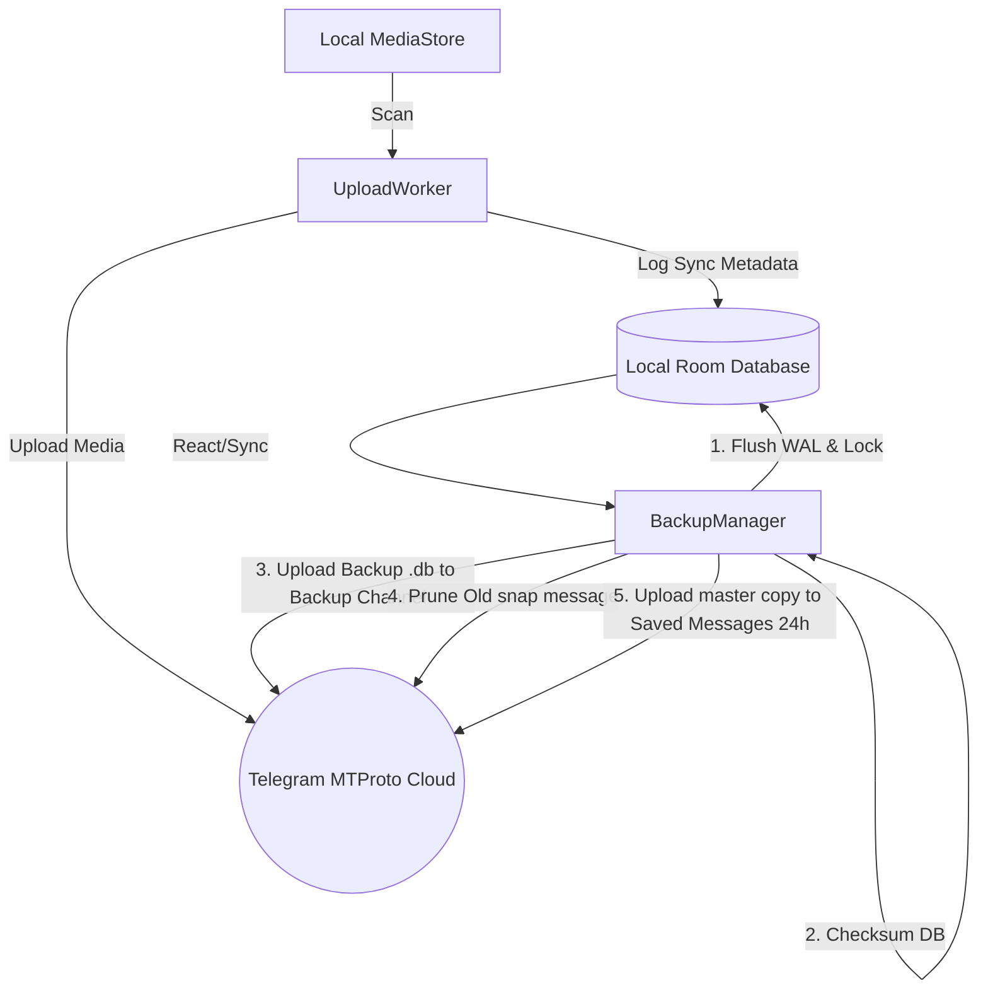
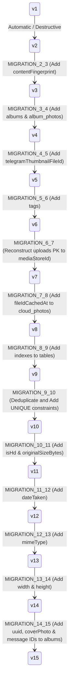
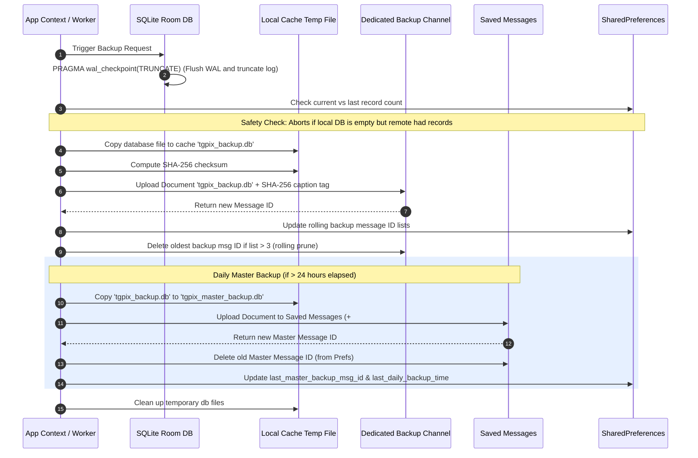
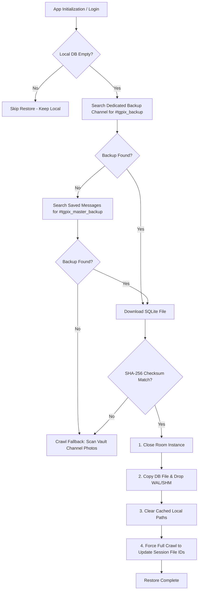

# TGPix Database and Backup Strategy

This document outlines the detailed production-ready Database and Backup Strategy for **TGPix**, a privacy-first, zero-middleman Android gallery powered by private Telegram cloud storage. 

This document serves as a technical reference for developers, reviewers, and operations before deploying changes to a production environment.

---

## 🗺️ Architectural Philosophy

TGPix operates on a **zero-middleman, offline-first client-server model**. Because there are no centralized backend servers or secondary databases, the system's design must guarantee absolute local integrity and secure cloud persistence.



1. **Telegram as the Primary Source of Truth**: All photos, thumbnails, and database backup files are persisted directly into private Telegram chats/channels using Telegram's MTProto mobile protocol via TDLib.
2. **Local Room Database as a High-Performance Cache**: To avoid constant, slow network roundtrips and Telegram rate-limiting, a local SQLite database (powered by Jetpack Room) indexes all sync statuses, cloud photo metadata, and user albums.
3. **Automated Remote Sync**: The local database state itself is periodically and reactively backed up to Telegram, ensuring that a user can lose their device or clear application storage without losing their gallery timeline or custom albums.
4. **Channel Isolation**: Separates media from operational backups to prevent cluttering the user's gallery timeline with database snapshot documents.

---

## 🗄️ Local SQLite Room Database Schema

The local database is declared in [UploadDatabase.kt](file:///E:/telegallery-calude/app/src/main/java/dev/ssjvirtually/tgpix/storage/UploadDatabase.kt) with a version scheme of **15**. It consists of four main tables:

### 1. `uploads`
Tracks local media paths that have been scanned and successfully synced to Telegram. This prevents redundant rescanning of local media files.
* **Kotlin Class Reference**: [UploadEntity](file:///E:/telegallery-calude/app/src/main/java/dev/ssjvirtually/tgpix/storage/UploadDatabase.kt#L22)
* **Primary Key**: `mediaStoreId` (Long)
* **Indices**: Unique index `idx_uploads_fingerprint` on `contentFingerprint`

| Column Name | SQLite Type | Nullable | Description |
|:---|:---|:---|:---|
| `mediaStoreId` (PK) | `INTEGER` | No | Android MediaStore unique identifier of the local asset. |
| `path` | `TEXT` | No | Absolute Android file URI/path of the local media file. |
| `contentFingerprint` | `TEXT` | No | Unique deduplication key representing the file size, name, and modify time. |
| `uploadedAt` | `INTEGER` | No | Epoch timestamp (ms) when the sync completed. |
| `telegramMessageId` | `INTEGER` | No | Unique ID of the Telegram message holding the uploaded photo. |

---

### 2. `cloud_photos`
Houses the metadata for all media assets stored in the user's private Telegram gallery channel. This table powers the timeline and detail views.
* **Kotlin Class Reference**: [CloudPhotoEntity](file:///E:/telegallery-calude/app/src/main/java/dev/ssjvirtually/tgpix/storage/UploadDatabase.kt#L59)
* **Primary Key**: `messageId` (Long)
* **Indices**:
  * `idx_cloud_photos_uploadedAt` on `uploadedAt`
  * `idx_cloud_photos_contentFingerprint` on `contentFingerprint`
  * `idx_cloud_photos_uniqueRemoteId` on `uniqueRemoteId`
  * `idx_cloud_photos_fileName` on `fileName`
  * Unique index `idx_cloud_photos_fingerprint` on `contentFingerprint`
  * Unique index `idx_cloud_photos_remote_id` on `uniqueRemoteId`

| Column Name | SQLite Type | Nullable | Description |
|:---|:---|:---|:---|
| `messageId` (PK) | `INTEGER` | No | Unique ID of the Telegram message holding the photo document. |
| `telegramFileId` | `INTEGER` | No | File reference ID in the current TDLib instance (volatile). |
| `uniqueRemoteId` | `TEXT` | No | Permanent unique identifier of the file on Telegram servers. |
| `fileName` | `TEXT` | No | Original name of the media file. |
| `uploadedAt` | `INTEGER` | No | Epoch timestamp of when the file was uploaded. |
| `fileSize` | `INTEGER` | No | File size in bytes. |
| `isDocument` | `INTEGER` | No | Boolean flag (`0` or `1`) indicating standard upload or uncompressed file mode. |
| `localCachedThumbnailPath` | `TEXT` | Yes | Local cache path of the downloaded thumbnail. |
| `localCachedLargePath` | `TEXT` | Yes | Local cache path of the downloaded high-resolution image. |
| `contentFingerprint` | `TEXT` | No | Deduplication key format: `"${fileName}_${fileSize}_${dateTaken}_${hash}"`. |
| `telegramThumbnailFileId` | `INTEGER` | No | TDLib file reference ID specifically for the preview thumbnail. |
| `tags` | `TEXT` | No | Space-separated list of search tags or metadata descriptors. |
| `fileIdCachedAt` | `INTEGER` | No | Timestamp of when the file ID was cached locally. |
| `isHd` | `INTEGER` | No | Flag indicating if uploaded image is in high-definition (uncompressed). |
| `originalSizeBytes` | `INTEGER` | No | Original size of the file before compression/upload. |
| `dateTaken` | `INTEGER` | No | Capture timestamp of the photo in milliseconds. |
| `mimeType` | `TEXT` | No | MIME content-type of the file (e.g. `image/jpeg`, `image/png`). |
| `width` | `INTEGER` | No | Width of the image in pixels. |
| `height` | `INTEGER` | No | Height of the image in pixels. |

---

### 3. `albums`
Contains user-defined local collections of photos.
* **Kotlin Class Reference**: [AlbumEntity](file:///E:/telegallery-calude/app/src/main/java/dev/ssjvirtually/tgpix/storage/UploadDatabase.kt#L118)
* **Primary Key**: `id` (INTEGER, Autoincrement)

| Column Name | SQLite Type | Nullable | Description |
|:---|:---|:---|:---|
| `id` (PK) | `INTEGER` | No | Auto-generated unique album identifier. |
| `uuid` | `TEXT` | No | Globally unique identifier (UUID string) representing this album. |
| `name` | `TEXT` | No | The user-defined album name. |
| `createdAt` | `INTEGER` | No | Timestamp of the album creation. |
| `telegramMessageId` | `INTEGER` | Yes | Message ID of the uploaded album JSON manifest. |
| `coverPhotoMessageId` | `INTEGER` | Yes | Message ID of the photo designated as the album's cover. |

---

### 4. `album_photos`
A junction table representing the Many-to-Many relationship between albums and synced photo elements.
* **Kotlin Class Reference**: [AlbumPhotoEntity](file:///E:/telegallery-calude/app/src/main/java/dev/ssjvirtually/tgpix/storage/UploadDatabase.kt#L135)
* **Primary Key**: Composite `(albumId, photoUri)`
* **Indices**:
  * `idx_album_photos_photoUri` on `photoUri`

| Column Name | SQLite Type | Nullable | Description |
|:---|:---|:---|:---|
| `albumId` (PK) | `INTEGER` | No | Foreign key mapping to `albums.id`. |
| `photoUri` (PK) | `TEXT` | No | Local path or Cloud unique remote ID associated with the album photo. |

---

## 📈 Database Migration History & Policy

TGPix maintains strict schema updates using explicit Room migration patterns located in [UploadDatabase.kt](file:///E:/telegallery-calude/app/src/main/java/dev/ssjvirtually/tgpix/storage/UploadDatabase.kt).

### Migration Ledger



1. **Version 6 ➔ 7 (`MIGRATION_6_7`)**
   * Reconstructs `uploads` table to use `mediaStoreId` as the primary key and creates unique constraint index on `contentFingerprint`.
2. **Version 7 ➔ 8 (`MIGRATION_7_8`)**
   * Adds `fileIdCachedAt` column to `cloud_photos` to expire stale local TDLib references.
3. **Version 8 ➔ 9 (`MIGRATION_8_9`)**
   * Adds critical performance indexes on query paths for `cloud_photos` (`uploadedAt`, `contentFingerprint`, `uniqueRemoteId`, `fileName`) and `album_photos` (`photoUri`).
4. **Version 9 ➔ 10 (`MIGRATION_9_10`)**
   * Performs data cleanup on legacy empty fingerprints/remotes and removes duplicate records before creating `UNIQUE` indexes on `contentFingerprint` and `uniqueRemoteId`.
5. **Version 10 ➔ 11 (`MIGRATION_10_11`)**
   * Adds `isHd` and `originalSizeBytes` columns to track dimensions and compression flags.
6. **Version 11 ➔ 12 (`MIGRATION_11_12`)**
   * Adds `dateTaken` and migrates historical records by setting `dateTaken` to `uploadedAt`.
7. **Version 12 ➔ 13 (`MIGRATION_12_13`)**
   * Adds `mimeType` column to distinguish images by their proper extension type.
8. **Version 13 ➔ 14 (`MIGRATION_13_14`)**
   * Adds `width` and `height` columns to optimize local rendering metrics.
9. **Version 14 ➔ 15 (`MIGRATION_14_15`)**
   * Adds `uuid` (UUID string), `telegramMessageId` (associated manifest document), and `coverPhotoMessageId` (album cover reference) to the `albums` table.

### ⚠️ Migration Fallback Policy
The database configuration includes the `.fallbackToDestructiveMigration()` modifier:
```kotlin
Room.databaseBuilder(...)
    .addMigrations(
        MIGRATION_1_2, MIGRATION_2_3, MIGRATION_3_4, MIGRATION_4_5, MIGRATION_5_6,
        MIGRATION_6_7, MIGRATION_7_8, MIGRATION_8_9, MIGRATION_9_10, MIGRATION_10_11,
        MIGRATION_11_12, MIGRATION_12_13, MIGRATION_13_14, MIGRATION_14_15
    )
    .fallbackToDestructiveMigration()
    .build()
```
> [!CAUTION]
> **Production Risk**: If a user updates their app between versions for which no explicit migration is defined, Room will execute `onDestructiveMigration()`, wipe the entire local SQLite database, and rebuild blank tables.
> 
> Because of this, the **Multi-Channel Backup and Restore strategy** is critical to recover custom user albums, covers, and sync tables without triggering long reconstruction crawls.

---

## 💾 Database Sync & Backup Mechanism

The database backup pipeline, managed by [BackupManager.kt](file:///E:/telegallery-calude/app/src/main/java/dev/ssjvirtually/tgpix/storage/BackupManager.kt), separates operations across three distinct Telegram environments:

### Chat Target Separation Architecture

1. **Vault Channel**: Houses only photo/video binaries. Provides a clean, readable gallery timeline.
2. **Dedicated Backup Channel** (`db_chat_id`): Receives SQLite database snapshots (tagged `#tgpix_backup`) and JSON album manifest documents (tagged `#tgpix_album`). Keep rolling list of the last **3 snapshots** and deletes older ones to conserve space.
3. **Saved Messages** (`myUserId`): Acts as a secure daily vault. Uploads a master database backup (tagged `#tgpix_master_backup`) **once every 24 hours** and prunes the old master message automatically.

---

### The Backup Pipeline Workflow



### 🔍 Core Implementation Details

#### 1. WAL Checkpointing (TRUNCATE)
SQLite under Room uses Write-Ahead Logging. To copy the database file safely, we execute a transaction-level checkpoint in [BackupManager.kt](file:///E:/telegallery-calude/app/src/main/java/dev/ssjvirtually/tgpix/storage/BackupManager.kt#L144):
```kotlin
db.openHelper.writableDatabase.execSQL("PRAGMA wal_checkpoint(TRUNCATE)")
```
This forces all changes pending in the `.db-wal` file to be committed to the main SQLite database binary and truncates the WAL file, preventing data loss when copying the database binary.

#### 2. The Local Record Count "Safety Lock"
To prevent a clean install or corrupted app state from overwriting a healthy remote backup with a blank DB, we inspect database record sizes before copying:
```kotlin
val currentCount = db.cloudDao().getRecordCountDirect()
val lastCount = PreferencesManager.getLastBackupRecordCount(context)

if (currentCount == 0 && lastCount > 0) {
    TdlibManager.addLog("Backup safety check failed: Local DB is empty, aborting upload to protect remote backup.")
    isBackupRunning = false
    return@withContext
}
```

#### 3. Integrity Verification (SHA-256 Checksum)
Before upload, a SHA-256 checksum is computed on the local database file and appended to the message caption (e.g. `sha256:<hash>`). During restoration, this hash is re-calculated and verified against the caption to ensure the downloaded file is not corrupt.

#### 4. Dedicated Backup Channel Rolling Window (3 Snapshots)
TGPix stores a rolling history of the **last 3 database backups** in the Dedicated Backup Channel. When a new backup is uploaded, its message ID is appended to SharedPreferences. If the size of the saved backup list exceeds 3, the oldest message ID is deleted from Telegram via TDLib (`DeleteMessages`).

#### 5. Saved Messages Daily Master Backup
To prevent channel clutter but ensure double redundancy, the app schedules a master backup (tagged `#tgpix_master_backup`) to the user's Saved Messages. It compares the current time with `last_daily_backup_time`. If more than 24 hours have elapsed:
* Uploads the master database copy to Saved Messages.
* Deletes the old master backup message using `last_master_backup_msg_id`.
* Updates the timestamps and message references in preferences.

#### 6. Reactive Sync Triggers
Backups are triggered automatically when the record count in `cloud_photos` changes (monitored via Composable grid lists) and when background workers complete sync operations.

---

## 🔄 Disaster Recovery (DR) & Restore Strategy

When a user logs in on a new device, their local database is empty. The restore engine checks for backups in a prioritized sequence.

### ⚙️ Recovery Priority Sequence



### ⚙️ Restore Implementation Details

#### 1. Prioritized Restore Resolution
During startup, [AppNavigation.kt](file:///E:/telegallery-calude/app/src/main/java/dev/ssjvirtually/tgpix/ui/AppNavigation.kt) executes `BackupManager.restoreDatabase(context)`. The method performs the search in order:
1. **Dedicated Backup Channel** (`db_chat_id`): Checks for `#tgpix_backup` documents (latest 3 snaps).
2. **Saved Messages** (`myUserId`): If step 1 fails, falls back to `#tgpix_master_backup` (max 24 hours old).

#### 2. Connection Swapping and WAL Drop
To avoid corrupting Room's runtime state:
1. `UploadDatabase.closeDatabase()` is invoked to terminate active SQLite connections.
2. The downloaded database file replaces the local file `upload_database`.
3. Leftover write-ahead log files (`upload_database-wal` and `upload_database-shm`) are deleted.
4. `UploadDatabase.getDatabase(context)` is re-initialized to open the database.

#### 3. Clearing Cached Local Paths
Immediately upon restoring the database binary, we execute:
```kotlin
newDb.cloudDao().clearAllCachedPaths()
```
This sets `localCachedThumbnailPath` and `localCachedLargePath` columns to `NULL`. This is critical: local file cache directories on the new device will not contain the cached image files from the old device. Clearing these paths forces the app to download thumbnails fresh rather than attempting to load invalid paths, preventing display bugs.

#### 4. Crucial: Session File ID Resolution (Force Full Crawl)
TDLib file reference IDs (`telegramFileId` and `telegramThumbnailFileId`) are **volatile session keys** that expire or change whenever TDLib is restarted or initialized on a new device. Restoring the database binary brings back stale file reference IDs.
* To resolve this, if the database restoration is successful, the app calls `TdlibManager.syncCloudHistory(context, chatId, forceFullCrawl = true)`.
* This forces a full crawl of the Telegram Vault channel. Instead of aborting when it sees an existing record, TDLib processes all messages, matches them to the restored records (via permanent `uniqueRemoteId` and `messageId`), and **overwrites the volatile `telegramFileId` and `telegramThumbnailFileId` with the current session's valid IDs**. This ensures all photos in the timeline can be successfully downloaded and viewed.

#### 5. Crawl Fallback & Album Reconstruction
If no database backups exist on Telegram (or checksums fail), the app falls back to a full reconstruction scan:
1. Crawls the Vault Channel backwards to index all image messages into `cloud_photos`.
2. Invokes `BackupManager.reconstructAlbumsFromBackupChannel(context)`.
3. Searches the Dedicated Backup Channel for documents tagged with `#tgpix_album`.
4. Downloads each JSON manifest, parses the album configuration (UUID, name, cover, photo message IDs), and inserts the database mappings to rebuild custom user albums.

---

## 🏃 Background Synchronization & Media Backup Engine

Background photo uploads are managed by [UploadWorker.kt](file:///E:/telegallery-calude/app/src/main/java/dev/ssjvirtually/tgpix/worker/UploadWorker.kt), which coordinates with Android WorkManager.

### Key Subsystems of the Upload Worker

1. **Foreground Service Promotion**: Elevates itself to a foreground service using `ServiceInfo.FOREGROUND_SERVICE_TYPE_DATA_SYNC` to bypass background runtime limits.
2. **WakeLock and WifiLock Guards**: Acquires power and network locks with a **1-hour safety limit** to prevent battery drain if network hangs.
3. **Reactive Deduplication**: Checks local photo fingerprints against `findByFingerprint()` in the database before uploading to prevent duplicates.
4. **Flood Prevention Throttle**: Inserts a mandatory **5-second delay** after every upload to prevent Telegram rate-limiting (`FLOOD_WAIT`).
5. **Real-time Indexing**: Immediately after a successful upload, `UploadWorker` and `ShareWorker` execute:
   ```kotlin
   TdlibManager.parseAndIndexUploadedMessage(applicationContext, uploadResult)
   ```
   This inserts the uploaded file's metadata directly into `cloud_photos` in real-time, causing Composable UI screens to immediately update the photo grid sync counters without waiting for a scheduled crawl.
6. **Concurrency Mutex Guard**: An in-memory mutex (`uploadMutex`) ensures that only one worker can process uploads at any given time, preventing database write conflicts.

---

## 🔐 Security, Privacy & Constraints

### 1. Security Architecture
* **Zero Middlemen**: SQLite databases and configuration settings are stored in the application's private sandbox folder (`/data/data/dev.ssjvirtually.tgpix/databases/`), protected by native Android sandbox constraints.
* **On-the-wire Encrypted Transport**: All file transfers and message metadata flows occur over the native MTProto connection between TDLib and Telegram's data centers.

### 2. Known Constraints & Vulnerabilities
* **Clear Text SHA-256**: The SHA-256 hash of the database backup is placed in cleartext within the Telegram message caption. While it only contains database checksums, an attacker with access to the Telegram account could read this value.
* **Account Reliance**: Because there are no backup servers, losing access to the Telegram account (due to bans, SIM card loss, or manual deletion) results in a complete, permanent loss of all photos and database history.
* **Fallback Scan Limitation**: Rebuilding the database from media messages cannot reconstruct user-defined albums (`albums` and `album_photos` tables), as that relationship only exists in the SQLite database backup.

---

## 📋 Pre-Launch Production Audit Checklist

Before releasing updates to production, verify the following database and backup behaviors:

- [ ] **Migration Scripts Validation**: Run target schema upgrades from version 1 all the way to version 15 to ensure no SQLite exceptions or table lock failures occur.
- [ ] **WAL Flush Validation**: Verify that `PRAGMA wal_checkpoint(TRUNCATE)` is executed and successfully merges logs prior to generating the SHA-256 checksum.
- [ ] **Empty DB Safety Check**: Simulate a wipe of local data while a backup exists on Telegram. Confirm that the backup worker aborts instead of uploading an empty database.
- [ ] **Integrity Failure Recovery**: Manually alter a byte in the downloaded database backup file during a restore sequence and verify that the SHA-256 mismatch is detected, aborting the restore to prevent local corruption.
- [ ] **Volatile ID Resolution**: Validate that after a database restore on a new device, a full crawl successfully runs and updates the volatile TDLib file IDs, allowing full resolution and download of images.
- [ ] **Thumbnail Paths Reset**: Verify that all local cached thumbnail and large paths are set to `NULL` upon database restore to prevent cache path collisions.
- [ ] **Lock Leaks Verification**: Confirm that both the `WakeLock` and `WifiLock` are released in the `finally` block under all execution scenarios (Success, Failure, Retry).
