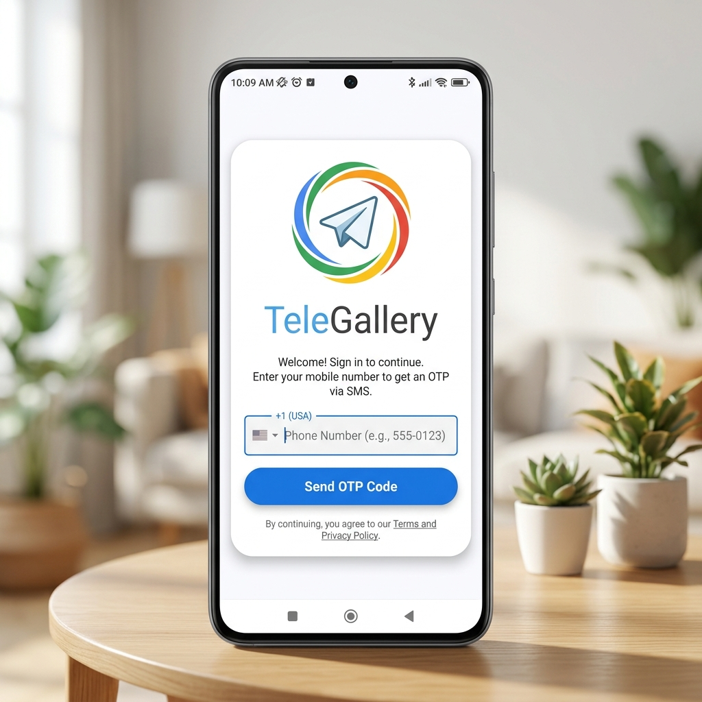
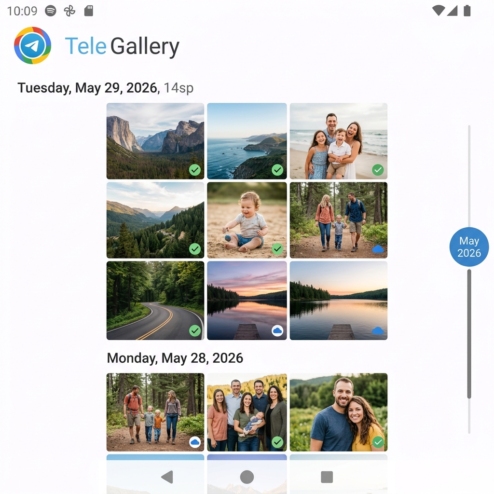
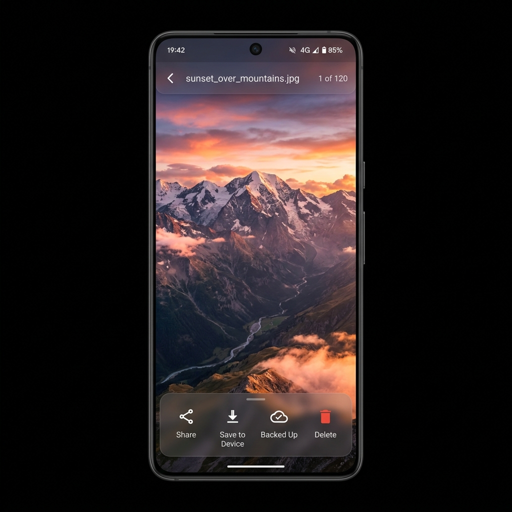
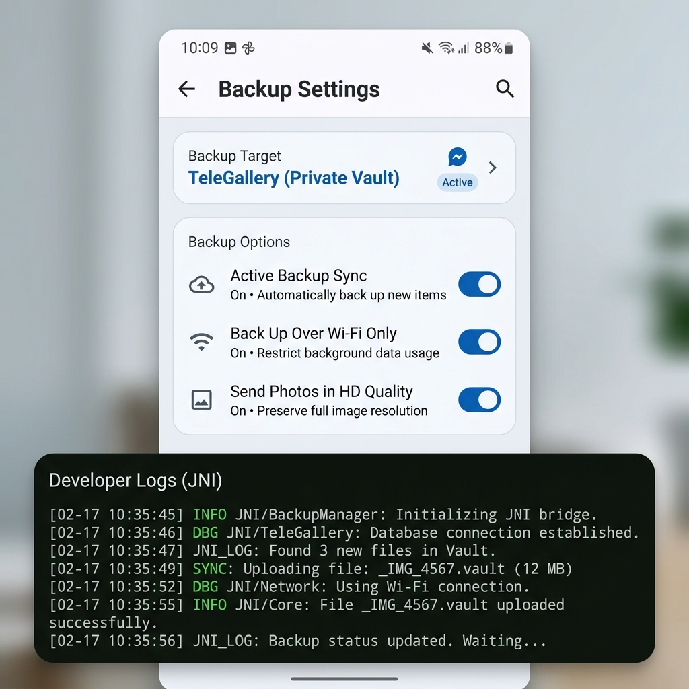

# <p align="center"></p>

<h1 align="center">TGPix</h1>

<p align="center">
  <strong>A premium, privacy-first Google Photos-style Android gallery backed by your own Telegram cloud storage.</strong>
</p>

<p align="center">
  <a href="https://github.com/ssJvirtually/TGPix/releases"></a>
  <a href="https://kotlinlang.org"></a>
  <a href="https://core.telegram.org/tdlib"></a>
  <a href="LICENSE"></a>
</p>

---

**TGPix** is an elegant, open-source Android application that provides an intuitive, high-performance photo gallery interface (matching Google Photos aesthetics) powered entirely by your private Telegram channels for unlimited, secure cloud media backups. It leverages the native MTProto backend through Telegram's TDLib to upload, synchronize, and stream your media seamlessly.

---

## 📲 Download & Installation

To try the latest version of TGPix, you can download the ready-to-run APK directly:
* **[Download Latest APK (v1.0.0)](https://github.com/ssJvirtually/TGPix/releases/download/v1.0.0/app-debug.apk)**

For all available versions, full changelogs, and target architectures, please visit the **[GitHub Releases Page](https://github.com/ssJvirtually/TGPix/releases)** to check for the latest binaries.

---

## ⚠️ Important Disclaimers

> [!WARNING]
> ### 🛑 Unofficial Project & Telegram Association
> TGPix is an **unofficial** third-party application. It is **not** affiliated, associated, authorized, endorsed by, or in any way officially connected with Telegram FZ-LLC, Telegram Messenger Inc., or any of their subsidiaries or affiliates.

> [!CAUTION]
> ### ⚡ Breaking Changes Notice
> This project is under active development. **Many breaking changes are coming in future releases.** Features, database schemas, and configuration models are subject to major adjustments without notice.

> [!IMPORTANT]
> ### 🔑 Account Responsibility & Data Loss Warning
> Your media is stored exclusively inside private Telegram supergroups/channels mapped to your active Telegram account.
> * **If you lose access to your Telegram account** (due to suspension, ban, loss of your active SIM card/phone number, or manual deletion), **you will permanently lose access to all backed-up cloud photos.**
> * **No Secondary Backups**: There is no secondary storage server, database backup server, or recovery pathway. Your data is strictly inside your Telegram account.
> * **Limitation of Liability**: The contributors, developers, committers, and maintainers of this project are **nowhere responsible** for any data loss, account suspensions, or technical issues that may arise from using this application. You use this software entirely at your own risk.

---

## 🔒 Security & Privacy (Zero-Middleman)

We believe in absolute transparency:
* **No Middleman Servers**: TGPix runs 100% on your device. Your photos are never routed through any third-party APIs, middleman servers, or analytical services.
* **Direct MTProto Transport**: All communication, authentication, and media uploads occur directly between your device and the official Telegram servers using MTProto.
* **Open Source Codebase**: Since the project is fully open source, you can review all file access and network logging calls directly in the source files.

---

## 🌟 Key Features

* **🎨 Immersive Google Photos Aesthetic**: A highly polished light-mode interface blending Telegram Blue (`#2481CC`) with clean, fluid surfaces (`#F4F6F9`) and dynamic modern typography.
* **⚡ Continuous Smooth Panning & Zoom**: Dynamic pinch-to-zoom gestures, custom boundaries checking, drag panning, swipe-to-dismiss, and centroid-based double-tap zoom for full-screen photo interactions.
* **📅 Floating Date Indicator**: A glassmorphic month/year bubble that tracks your finger dynamically during fast-scrolling sweeps.
* **🔄 Intelligent Deduplication Sync**: Uses a reactive SQLite Room database to track upload fingerprints, bypassing duplicates even when running manual backup sweeps.
* **☁️ Multi-Device Vault Onboarding**: Uses cryptographically verified signatures (derived from your unique user ID) pinned in your Telegram channel to automatically find, link, or provision your private gallery vault across multiple devices.
* **🖼️ Lazy Load & Thumbnail Cache**: Displays compressed previews instantly while loading full-resolution photo assets in the background.

---

## 📱 Application Screens

| 🔐 1. OTP Phone Login | 📅 2. Timeline Grid View |
|:---:|:---:|
|  |  |

| 🖼️ 3. Immersive Detail View | ⚙️ 4. Settings Dashboard |
|:---:|:---:|
|  |  |

---

## 🛠️ Tech Stack & Architecture

* **UI Framework**: Jetpack Compose (M3) for declarative, reactive UI layouts.
* **Core Transport**: Telegram TDLib JNI wrapper (v1.8.56) for secure Telegram socket connection.
* **Database Layer**: Room SQLite Database for storing local sync status and photo registry logs.
* **Image Processor**: Coil Compose for lazy-loaded image rendering and bitmap downsampling.
* **Background Processing**: Android Jetpack WorkManager for periodic background backups.

---

## 🚀 How to Build Locally

Follow these steps to configure your environment and build TGPix from the source code.

### 📋 Prerequisites
1. **Java JDK 17**: Make sure JDK 17 is installed on your computer.
2. **Android SDK (API 34)**: Ensure compile-tools and Android SDK are set up.
3. **Telegram API credentials**:
   * Log in to [my.telegram.org](https://my.telegram.org).
   * Create an application to get your `api_id` and `api_hash`.

### 💻 Build Instructions (Gradle Wrapper)

#### 1. Setup API Keys
Because `local.properties` is ignored in Git to prevent credentials leaks, you must create it in the root folder of the project:
1. Open or create the [local.properties](file:///E:/tgpix-calude/local.properties) file in the root folder of the project.
2. Add your Telegram credentials as follows:
   ```properties
   TELEGRAM_API_ID=YOUR_TELEGRAM_API_ID
   TELEGRAM_API_HASH="YOUR_TELEGRAM_API_HASH"
   ```
   *(Note: Wrap your `api_hash` in double-quotes as shown above).*

#### 2. Set Environment Variables
Open PowerShell or your command line in the project root directory and set the Java and Android SDK path variables:
```powershell
$env:JAVA_HOME="C:\Program Files\Java\jdk-17"
$env:ANDROID_HOME="C:\Users\YOUR_USER\AppData\Local\Android\Sdk"
```

#### 3. Compile the Debug APK
Run the Gradle wrapper assemble task:
```powershell
.\gradlew.bat assembleDebug
```
Once the build completes, your debug APK will be located at:
`app/build/outputs/apk/debug/app-debug.apk`

---

## 🤝 Contributing, Forking & License

This project is licensed under the **MIT License**.

* **Open for Contributions**: Pull requests, bug reports, and features suggestions are welcome! Feel free to open an issue or submit a PR.
* **Forks**: You are free to fork this repository, make changes, and use them for your own personal use.

---

*TGPix - Powered by unlimited, secure Telegram cloud vaults.*
