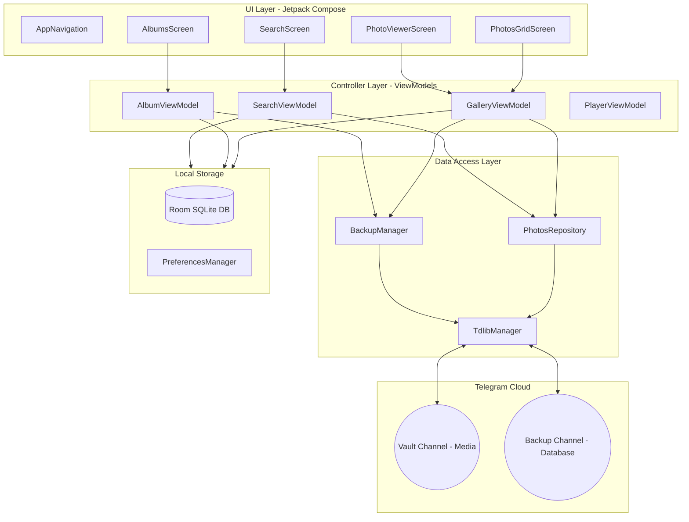

# TGPix — AI Agent Developer Guide
Welcome, Agent! This document is a specialized onboarding manual and design ledger for AI coding assistants working on the TGPix codebase. It outlines the architecture, database design, critical background flows, codebase constraints, and guidelines for developer safety.

---

## 1. Project Overview & Pitch
**TGPix** is a privacy-first, offline-first Android photo and video gallery app (a Google Photos clone) that uses **private Telegram channels (via MTProto/TDLib)** as a free, unlimited, and encrypted cloud storage backend. 
* **Zero Middlemen**: The app runs entirely client-side on the user's Android device. There are no application servers or proxy backends.
* **Storage Model**: Media files are uploaded directly to a private Telegram "Vault" channel. Database backups, metadata, and album configurations are uploaded to a secondary "Backup" channel.

---

## 2. Core Architecture System
TGPix adheres to an **offline-first MVVM (Model-View-ViewModel)** architectural pattern:



### Architecture Layers & Responsibilities:
1. **UI Layer (Screens)**: Written in Jetpack Compose. Screens must be stateless, observing state from ViewModels using `.collectAsState()`. **Never run raw database operations (Room) or network operations directly inside screens.**
2. **ViewModel Layer (Presentation Logic)**:
   * [GalleryViewModel](file:///E:/telegallery-calude/app/src/main/java/dev/ssjvirtually/tgpix/ui/GalleryViewModel.kt): Manages local photo scans, the combined local/cloud timeline merge state, and upload status.
   * [AlbumViewModel](file:///E:/telegallery-calude/app/src/main/java/dev/ssjvirtually/tgpix/ui/AlbumViewModel.kt): Manages album CRUD operations and coordinates changes with the `BackupManager`.
   * [SearchViewModel](file:///E:/telegallery-calude/app/src/main/java/dev/ssjvirtually/tgpix/ui/SearchViewModel.kt): Handles debounced query states, CPU-heavy in-memory local photo filtering, and background FTS database lookups.
   * [PlayerViewModel](file:///E:/telegallery-calude/app/src/main/java/dev/ssjvirtually/tgpix/ui/PlayerViewModel.kt): Manages video playback state (buffering, position, controls) for upcoming video integration.
3. **Repository Layer (Coordination)**:
   * `PhotosRepository`: Combines local `MediaStore` scanned files with SQLite cloud records, executing multi-layered deduplication (fingerprinting).
   * `TdlibManager`: Direct JNI wrapper to TDLib. Manages user session auth (OTP/2FA), connectivity callback, and file transfer pipelines.
   * `BackupManager`: Generates SQLite WAL checkpoints, creates encrypted DB snapshots, and manages restore crawls.

---

## 3. Database Schema & FTS Searching
TGPix stores metadata locally in a Jetpack Room SQLite database: [UploadDatabase.kt](file:///E:/telegallery-calude/app/src/main/java/dev/ssjvirtually/tgpix/storage/UploadDatabase.kt).

### Database Guidelines:
* **Current Version**: 18.
* **Full-Text Search (FTS)**: Integrated using Room's `@Fts4` mapping (`cloud_photos_fts`) targeting the tags and filename fields of `cloud_photos`.
* **Triggers**: FTS synchronization triggers (`room_fts_content_sync_cloud_photos_fts_*`) are handled natively by Room using `docid` and `rowid` mapping.
* **Migrations**: Changes to the database schema must be documented with an explicit migration class in `UploadDatabase.Companion` and added to `.addMigrations(...)` in the Room builder. Never use destructive migrations in production.

---

## 4. Key Flows & Code Entry Points

### A. Media Matching & Deduplication Flow
To show a seamless combined timeline without duplicating photos that are both on the device and backed up:
1. `MediaStoreScanner` crawls local files.
2. `GalleryViewModel` combines local photos with `cloud_photos` logs and staged `uploads` entries.
3. `PhotosRepository.mergeAndDeduplicate` performs sequential checks:
   * **Fingerprint match**: `filename_size_dateTaken`.
   * **Filename match**: normalized lowercase filename.
   * **Date + Size match**: checking standard parsing patterns from filenames.
4. Synced local photos are flagged with their remote tags; unsynced ones are flagged for upload. Uncached cloud photos are fetched lazily.

### B. High-Performance Hybrid Search Flow
1. User types in [SearchScreen.kt](file:///E:/telegallery-calude/app/src/main/java/dev/ssjvirtually/tgpix/ui/screens/SearchScreen.kt).
2. `SearchViewModel` debounces input by 200ms inside the Flow pipeline.
3. **Local Search**: Filters pre-indexed memory keywords on `Dispatchers.Default`.
4. **Cloud Search**: Queries the database using `MATCH` on the `cloud_photos_fts` virtual table.
5. Search results are merged, deduplicated by URI, and sorted chronologically in the background.

---

## 5. Coding Guidelines & Guardrails
To prevent code rot and keep development speed high, obey these rules:

> [!IMPORTANT]
> **MVVM Separation of Concerns**
> * Composable screens must remain purely declarative.
> * Database queries (e.g., using `UploadDatabase.getDatabase(context)`) and network calls must live inside ViewModels or Repository wrappers.
> * If a screen needs a background action (e.g. batch uploads), fetch the database helper dynamically inside the launch coroutine on `Dispatchers.IO` rather than caching it at the Composable scope.

> [!TIP]
> **Coroutines and Threading**
> * **CPU-intensive work** (filtering, deduplication, merging): Run on `Dispatchers.Default`.
> * **Database & File I/O** (writing to SQLite, uploading/downloading, reading MediaStore): Run on `Dispatchers.IO`.
> * **UI state updates**: Collect flow state on the main thread via standard Compose state collection.

> [!CAUTION]
> **TdlibManager Safety**
> * `TdlibManager` is a critical JNI integration. Do not add ad-hoc business logic or unrelated utility functions to it. Keep it strictly focused on client lifecycle, channel authentication, and raw socket message passing.

---

## 6. Project Knowledge Graph
TGPix utilizes a **graphify** knowledge graph index under `graphify-out/` to track codebase relationships and structure.
* If you have modified code files during a session, run:
  ```powershell
  graphify update .
  ```
  to keep the node map and architecture summary updated.
* If you need to trace relationships between classes or files, consult `graphify-out/GRAPH_REPORT.md` or use the graph query CLI tool.
