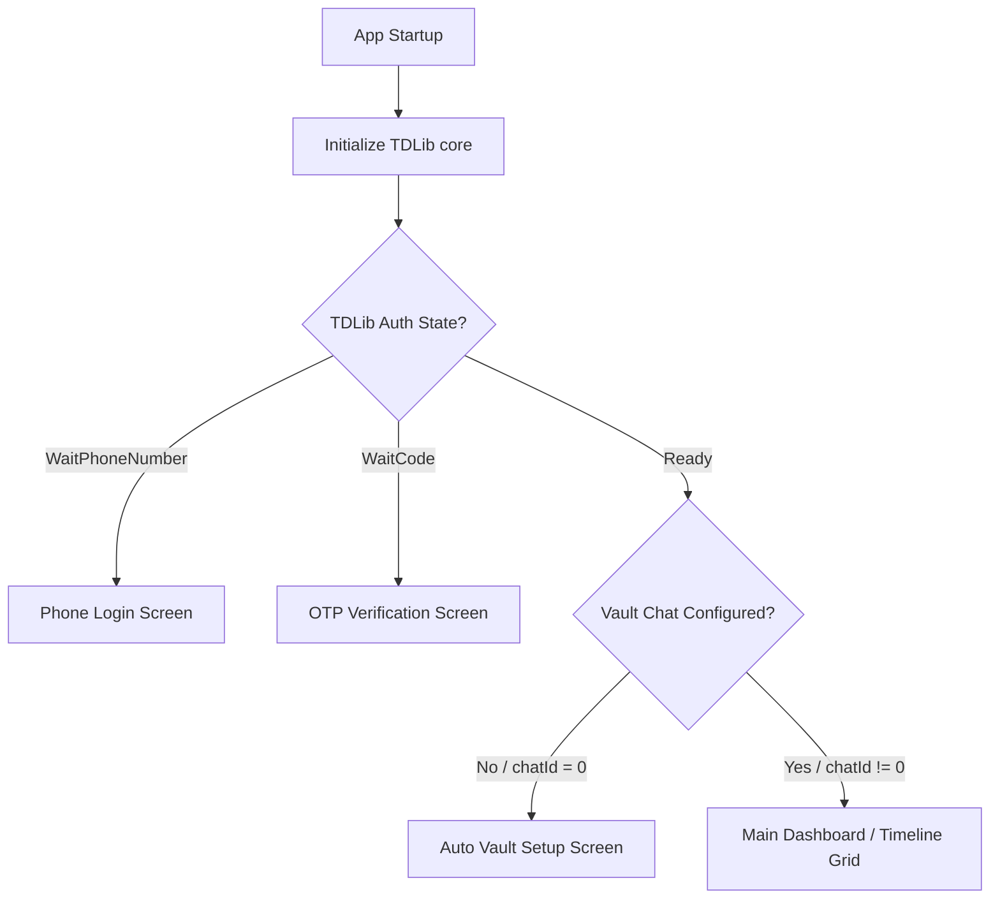
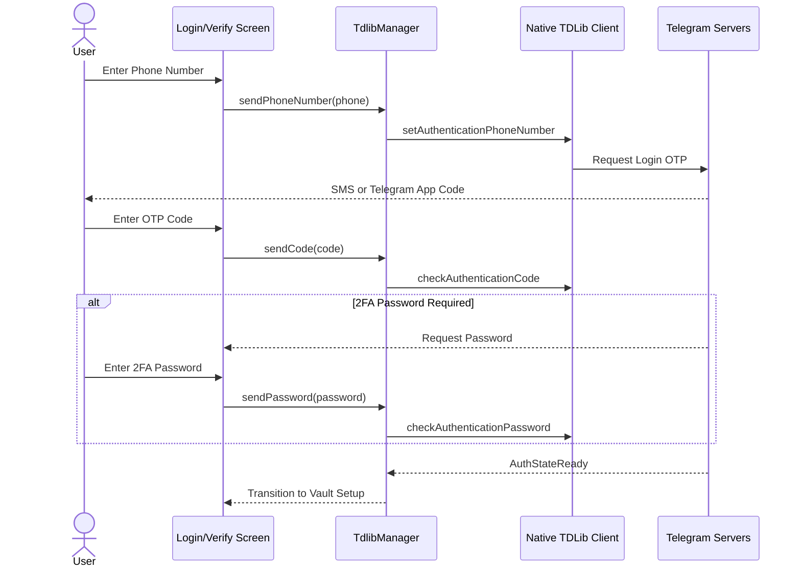
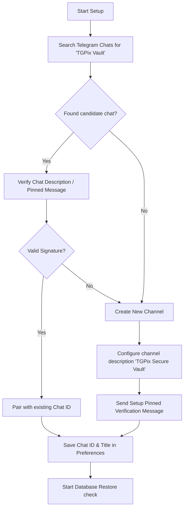
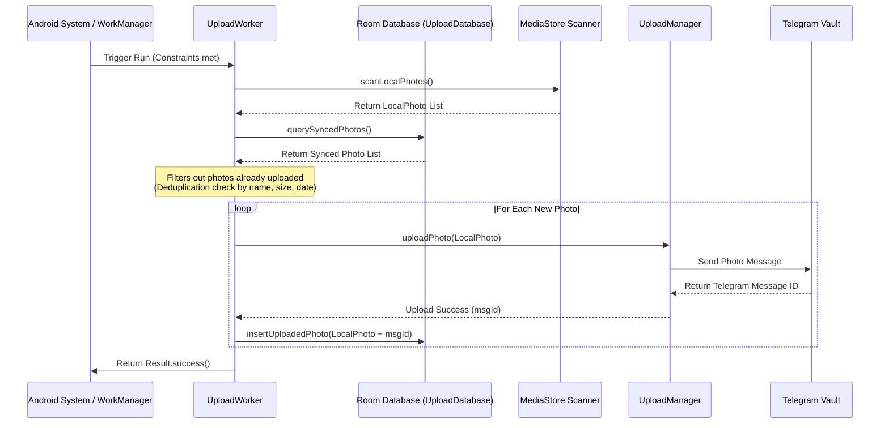
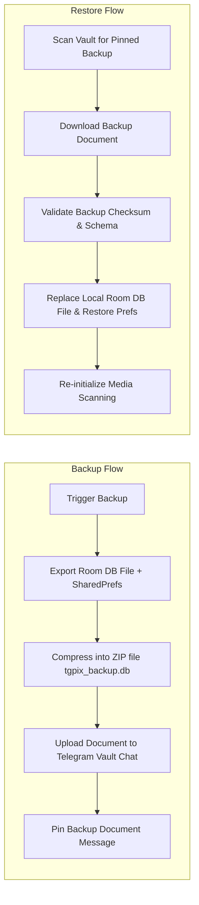
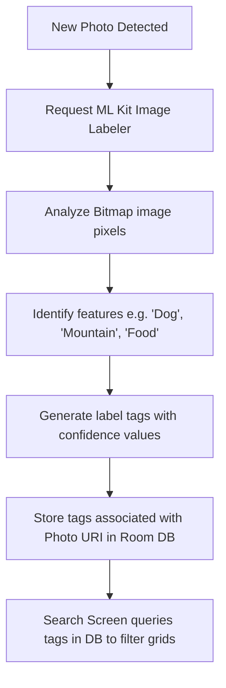
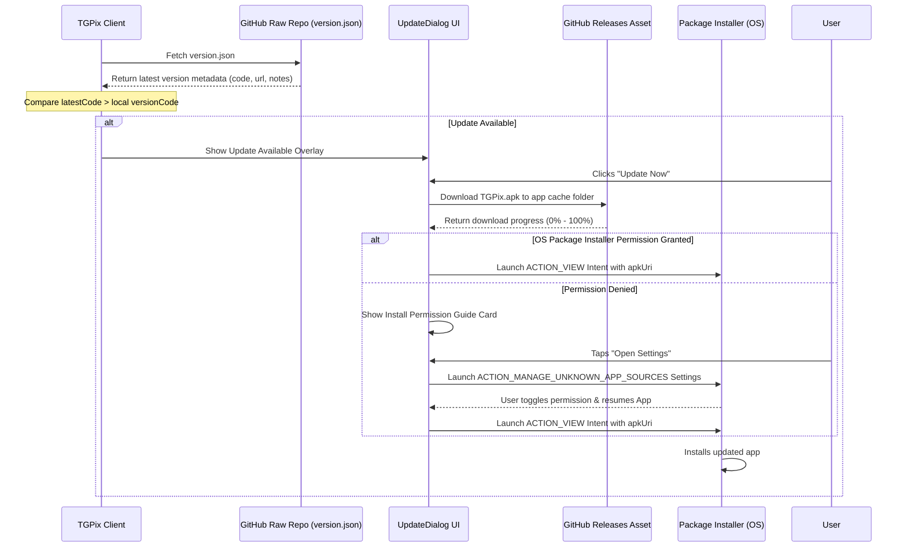

m# TGPix Application Flows & Architecture

This document provides a detailed breakdown of all the logical flows and architectural designs within the TGPix application. TGPix is a privacy-first, on-device Google Photos-like backup manager that uses **Telegram API (via TDLib)** as a free, encrypted cloud storage vault.

---

## 1. App Startup & Routing Flow

When the app is opened, `MainActivity` initializes TDLib and decides which screen to show based on two main conditions: **Telegram Authentication State** and **Vault Configuration State**.

### Flow Steps:
1. **TDLib Initialization:** [TdlibManager](file:///E:/telegallery-calude/app/src/main/java/dev/ssjvirtually/tgpix/telegram/TdlibManager.kt) initializes the TDLib native client database, folders, and logging options.
2. **Auth Verification:** Reads `authState` flow. If authentication is not complete, users are guided through Phone/OTP login.
3. **Preferences Lookup:** Checks `PreferencesManager.getChatId()`.
   * If `0`, redirects user to set up a backup channel.
   * If a valid ID is present, opens the timeline and schedules the background `UploadWorker` if background syncing is enabled.

---

## 2. Telegram Authentication Flow

Handles secure authentication directly with Telegram servers. Supports phone number inputs, OTP code delivery, and two-factor authentication (2FA) password prompts.

### Key Components:
* **[PhoneLoginScreen.kt](file:///E:/telegallery-calude/app/src/main/java/dev/ssjvirtually/tgpix/ui/screens/PhoneLoginScreen.kt):** Handles country code selection and standardizes international phone number formatting.
* **[OtpVerifyScreen.kt](file:///E:/telegallery-calude/app/src/main/java/dev/ssjvirtually/tgpix/ui/screens/OtpVerifyScreen.kt):** Handles OTP digits entry and optional 2FA password prompts if security layers are enabled.

---

## 3. Auto Vault Setup Flow

Automatically discovers an existing TGPix vault chat on the user's Telegram account or provisions a new one.

### Verification Criteria:
To distinguish the TGPix vault from standard chats:
1. Search public/private channels matching the target name `TGPix Vault`.
2. Inspect the channel description or verify a pinned setup message to match signature properties.

---

## 4. Background Sync & Image Backup Flow

Ensures newly captured photos are automatically uploaded to the Telegram Vault under specific battery and connection constraints.

### Performance & Data Safeguards:
* **Deduplication:** Queries the database using file criteria (name, size, timestamp) so that files aren't uploaded multiple times if paths or indexes change.
* **WorkManager Constraints:** Syncing is run selectively based on settings (e.g. only on Wi-Fi, only when charging, or allowed on mobile networks).
* **HD Backup Mode:** If disabled, uploads are compressed to save cloud space. If enabled, files are sent as uncompressed raw documents (`sendDocument`).

---

## 5. Catalog Backup & Recovery Flow (Disaster Recovery)

TGPix backs up its metadata catalog (synced history index and album setups) directly to Telegram. This allows full database state recovery when logging in on a new phone.

* **Safety:** Prevents rebuilding a catalog from scratch, retaining remote file mappings and local album assignments across re-installations.
* **Location:** Uses [BackupManager.kt](file:///E:/telegallery-calude/app/src/main/java/dev/ssjvirtually/tgpix/storage/BackupManager.kt) for execution.

---

## 6. On-Device Search & ML Labeling Flow

Indexes local photos by their actual contents using Google ML Kit. Everything happens strictly on the device to maintain complete user privacy.

* **No Server Required:** Search relies completely on the local database index built inside the app background tasks.
* **Location:** Triggered during grid loads and background passes inside [SearchScreen.kt](file:///E:/telegallery-calude/app/src/main/java/dev/ssjvirtually/tgpix/ui/screens/SearchScreen.kt).

---

## 7. In-App Auto-Update Flow

This flow keeps the app up to date with the latest releases hosted on the GitHub repository.

### Components Involved:
* **[version.json](file:///E:/telegallery-calude/version.json):** Configuration describing the update.
* **[UpdateManager.kt](file:///E:/telegallery-calude/app/src/main/java/dev/ssjvirtually/tgpix/update/UpdateManager.kt):** Checks versioning, fetches the APK file stream, and initiates the OS Package Installer intent.
* **[UpdateDialog.kt](file:///E:/telegallery-calude/app/src/main/java/dev/ssjvirtually/tgpix/update/UpdateDialog.kt):** Handles the progressive dialog state UI (Checking, Ready, Downloading, Settings Request, Error, Complete).
