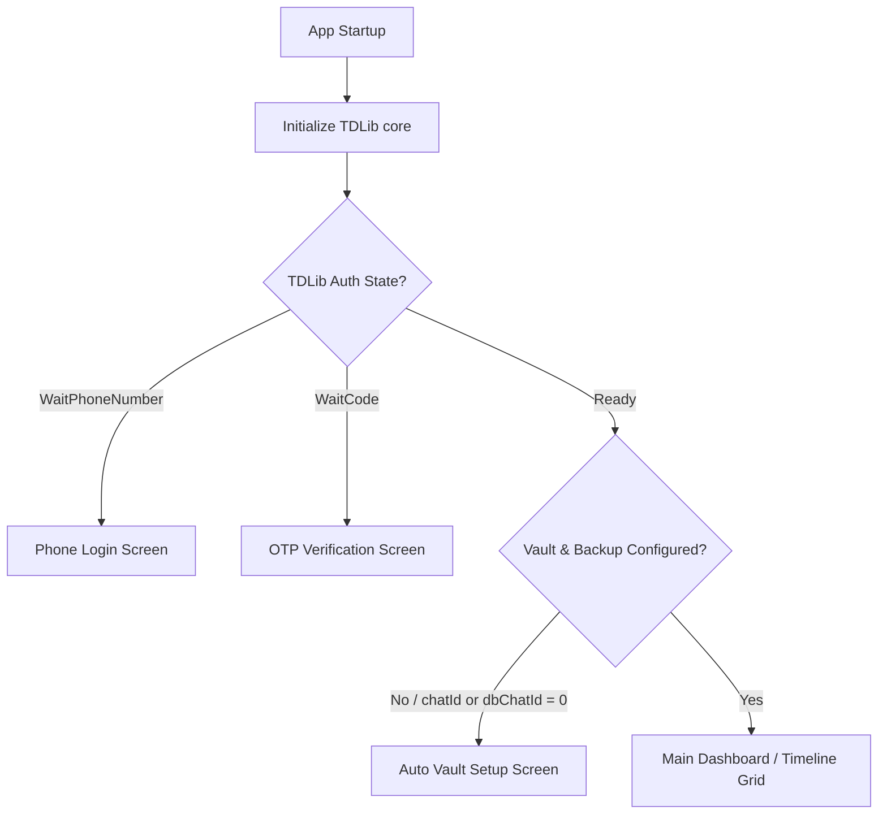
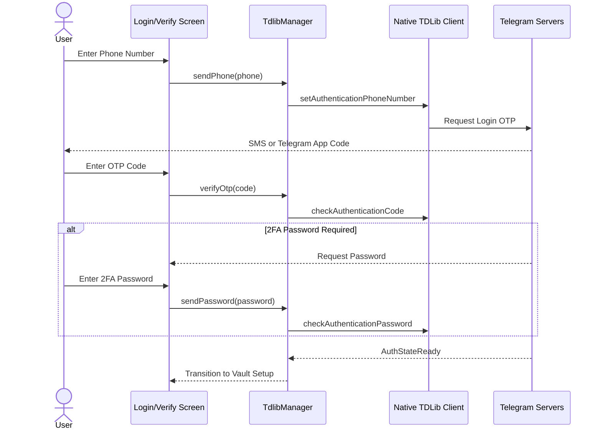
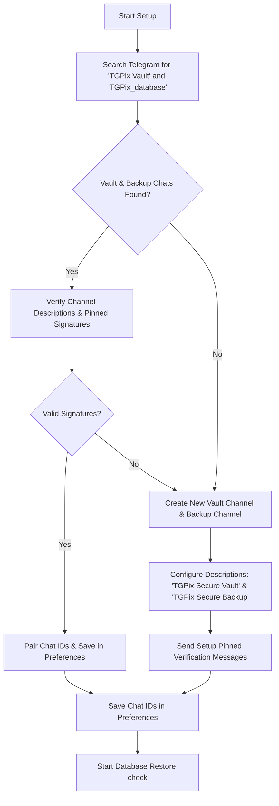
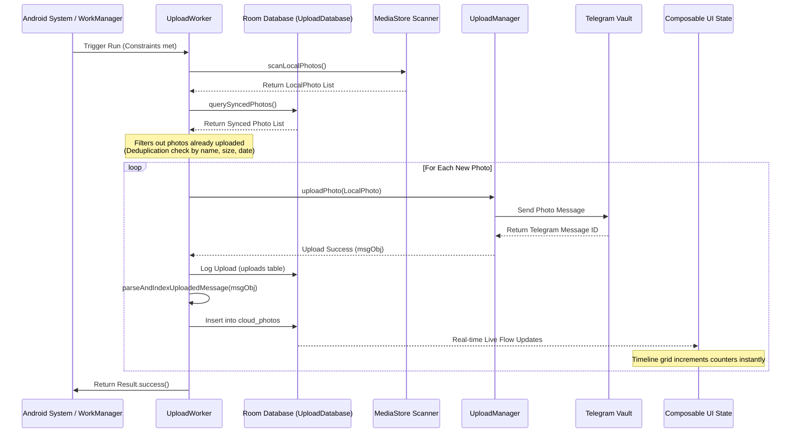
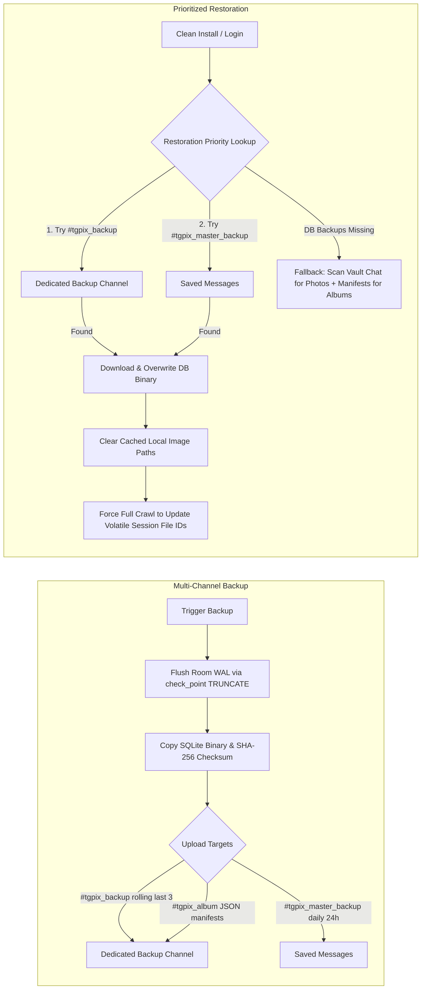
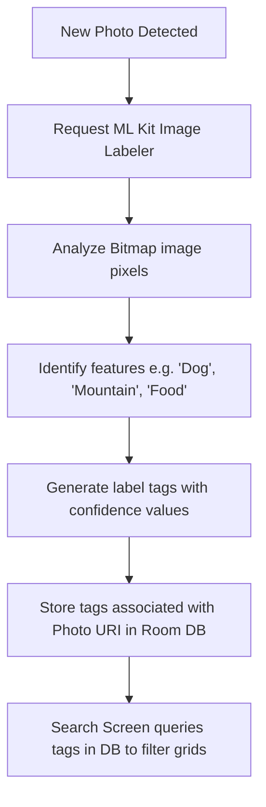
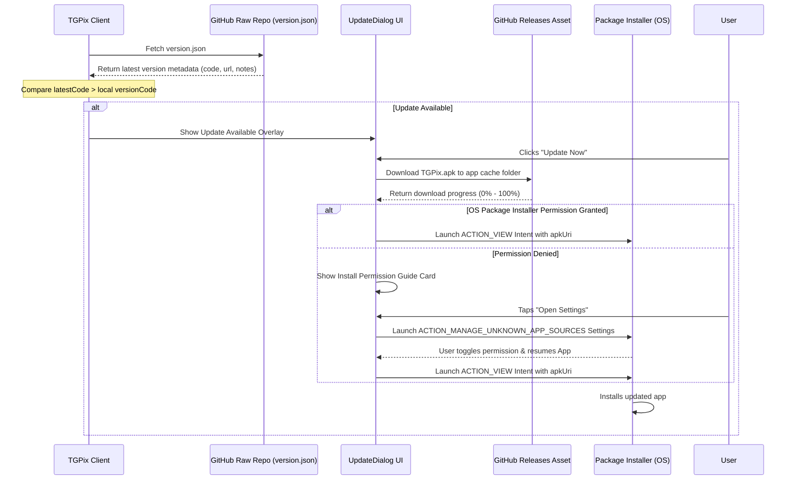

# TGPix Application Flows & Architecture

This document provides a detailed breakdown of all the logical flows and architectural designs within the TGPix application. TGPix is a privacy-first, on-device Google Photos-like backup manager that uses **Telegram API (via TDLib)** as a free, encrypted cloud storage vault.

---

## 1. App Startup & Routing Flow

When the app is opened, [MainActivity.kt](file:///E:/telegallery-calude/app/src/main/java/dev/ssjvirtually/tgpix/MainActivity.kt) initializes TDLib and decides which screen to show based on two main conditions: **Telegram Authentication State** and **Vault Configuration State**.

### Flow Steps:
1. **TDLib Initialization:** [TdlibManager.kt](file:///E:/telegallery-calude/app/src/main/java/dev/ssjvirtually/tgpix/telegram/TdlibManager.kt) initializes the TDLib native client database, folders, and logging options.
2. **Auth Verification:** Reads the `authState` flow. If authentication is not complete, users are guided through Phone/OTP login.
3. **Preferences Lookup:** Checks `PreferencesManager.getChatId()` and `PreferencesManager.getDbChatId()`.
   * If either is `0`, redirects the user to the [AutoVaultSetupScreen.kt](file:///E:/telegallery-calude/app/src/main/java/dev/ssjvirtually/tgpix/ui/screens/AutoVaultSetupScreen.kt).
   * If both valid IDs are present, opens the timeline and schedules the background `UploadWorker` if background syncing is enabled.

---

## 2. Telegram Authentication Flow

Handles secure authentication directly with Telegram servers. Supports phone number inputs, OTP code delivery, and two-factor authentication (2FA) password prompts.

### Key Components:
* **[PhoneLoginScreen.kt](file:///E:/telegallery-calude/app/src/main/java/dev/ssjvirtually/tgpix/ui/screens/PhoneLoginScreen.kt):** Handles country code selection and standardizes international phone number formatting.
* **[OtpVerifyScreen.kt](file:///E:/telegallery-calude/app/src/main/java/dev/ssjvirtually/tgpix/ui/screens/OtpVerifyScreen.kt):** Handles OTP digits entry and optional 2FA password prompts if security layers are enabled.

---

## 3. Auto Vault Setup Flow

Automatically discovers existing TGPix vault and database backup chats on the user's Telegram account or provisions new ones.

### Vault Discovery Verification Criteria:
1. Search public/private channels matching the target media name `TGPix Vault` and database backup name `TGPix_database`.
2. Inspect channel descriptions to match signature properties.

### Key Components:
* **[AutoVaultSetupScreen.kt](file:///E:/telegallery-calude/app/src/main/java/dev/ssjvirtually/tgpix/ui/screens/AutoVaultSetupScreen.kt):** Automatically creates or pairs the user-facing media channel (`chat_id`) and the private backup channel (`db_chat_id`) concurrently during signup.

---

## 4. Background Sync & Image Backup Flow

Ensures newly captured photos are automatically uploaded to the Telegram Vault under specific battery and connection constraints, updating local indicators in real-time.

### Performance & Data Safeguards:
* **Deduplication:** Queries the database using file criteria (name, size, timestamp) so that files aren't uploaded multiple times if paths or indexes change.
* **WorkManager Constraints:** Syncing is run selectively based on settings (e.g. only on Wi-Fi, only when charging, or allowed on mobile networks).
* **HD Backup Mode:** If disabled, uploads are compressed to save cloud space. If enabled, files are sent as uncompressed raw documents (`sendDocument`).
* **Real-time Indexing:** Uploaded assets are indexed into the local `cloud_photos` cache immediately after upload via `parseAndIndexUploadedMessage` in [TdlibManager.kt](file:///E:/telegallery-calude/app/src/main/java/dev/ssjvirtually/tgpix/telegram/TdlibManager.kt). This updates the UI state reactively as uploads proceed, preventing the need to wait for a full scheduled crawl.

---

## 5. Catalog Backup & Recovery Flow (Disaster Recovery)

TGPix backs up its metadata catalog (synced history index and album setups) directly to Telegram, separating user media, operational database backups, and personal Saved Messages.

### Core Architecture and Mechanics:
* **Prioritized Restore:** [BackupManager.kt](file:///E:/telegallery-calude/app/src/main/java/dev/ssjvirtually/tgpix/storage/BackupManager.kt) searches the Dedicated Backup Channel first for the newest rolling database backup. If unavailable, it searches the user's Saved Messages for the daily master database backup.
* **Crawl Fallback:** If both database backups are missing, the system crawls the media Vault Channel history to rebuild timeline cache records and crawls the Dedicated Backup Channel for `#tgpix_album` manifest JSON documents to reconstruct custom user albums.
* **Volatile File ID Resolution:** When a database is successfully restored, the app calls `TdlibManager.syncCloudHistory` with `forceFullCrawl = true`. Because TDLib file reference IDs are volatile and expire across sessions, this forces a complete scan to match channel messages with restored records and update the local volatile `telegramFileId` and `telegramThumbnailFileId` values for the new session.
* **Thumbnail Path Clean Up:** During restoration, the database cache paths are cleared (`clearAllCachedPaths()`), resetting local thumbnail and large paths to `NULL`. This forces the app to download thumbnails fresh on the new device, preventing cache path collisions and display bugs.

---

## 6. On-Device Search & ML Labeling Flow

Indexes local photos by their actual contents using Google ML Kit. Everything happens strictly on the device to maintain complete user privacy.

* **No Server Required:** Search relies completely on the local database index built inside the app background tasks.
* **Location:** Triggered during grid loads and background passes inside [SearchScreen.kt](file:///E:/telegallery-calude/app/src/main/java/dev/ssjvirtually/tgpix/ui/screens/SearchScreen.kt).

---

## 7. In-App Auto-Update Flow

This flow keeps the app up to date with the latest releases hosted on the GitHub repository.

### Components Involved:
* **[version.json](file:///E:/telegallery-calude/version.json):** Configuration describing the update.
* **[UpdateManager.kt](file:///E:/telegallery-calude/app/src/main/java/dev/ssjvirtually/tgpix/update/UpdateManager.kt):** Checks versioning, fetches the APK file stream, and initiates the OS Package Installer intent.
* **[UpdateDialog.kt](file:///E:/telegallery-calude/app/src/main/java/dev/ssjvirtually/tgpix/update/UpdateDialog.kt):** Handles the progressive dialog state UI (Checking, Ready, Downloading, Settings Request, Error, Complete).
