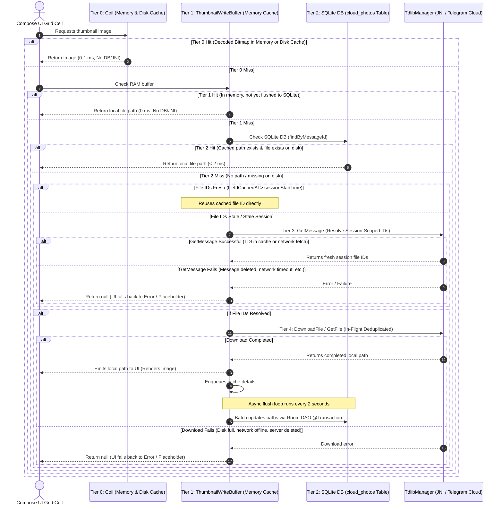

# TGPix — Cloud Thumbnail Caching & Loading Strategy (v1.1)

This document outlines the architecture, performance guardrails, and lifecycle mechanisms implemented in **TGPix** to display encrypted cloud thumbnails from private Telegram vaults smoothly. It incorporates technical fixes to prevent UI stutter, database lockouts, redundant network downloads, and recycler crashes during high-speed scrolling.

---

## 1. Architectural Overview & Data Flow

The thumbnail loading strategy uses a **pull-on-demand model** with a **5-tier caching system** combined with an **asynchronous batch-flushing buffer** to minimize database and JNI (Java Native Interface) overhead.



### Key Error States & Fallbacks
When a resource load fails, the UI handles it gracefully instead of spinning indefinitely:
* **Loading State**: Displays a low-contrast circular progress indicator.
* **Ready State**: Displays the loaded thumbnail via Coil.
* **Unavailable / Network Error State**: If the message is deleted, the network is offline, or TDLib is unauthenticated, the resolver returns `null`. The image container defaults to a fallback vector icon (e.g., cloud-off or broken-image asset).

---

## 2. The Multi-Tiered Cache Architecture

To ensure the Jetpack Compose grid can render cells at 120 FPS, the path resolution sequence follows a strict hierarchy of increasing cost:

| Tier | Source | Medium | Fetch Cost | Scope / Purpose |
|---|---|---|---|---|
| **Tier 0** | Coil Memory & Disk | RAM / Disk (`coil.ImageLoader`) | `~0 ms` (RAM) / `~1 ms` (Disk) | Caches decoded `Bitmap` objects in RAM and encoded file bytes on disk. Resolves immediately without invoking TGPix code. |
| **Tier 1** | `ThumbnailWriteBuffer` | RAM (`ConcurrentHashMap`) | `~0.01 ms` | Resolves paths that were downloaded recently but haven't been written to SQLite yet. Prevents duplicate downloads if an item recomposes immediately. |
| **Tier 2** | `cloud_photos` | SQLite database | `< 2 ms` | Resolves persistent paths on disk. If the database record contains the path and the physical file exists, it is loaded immediately. |
| **Tier 3** | JNI / TDLib Database | Local C++ TDLib DB / Network | `~15 - 50 ms` (cached) / `200ms - 2s+` (remote) | Resolves session-scoped file IDs. If TDLib has the message cached locally, it takes `< 50ms`. If it must fetch from Telegram servers (session reset), it takes `200ms - 2s+`. |
| **Tier 4** | Telegram Cloud | Private Vault Channel | `Variable` | Downloads the binary file from Telegram servers to local storage. |

---

## 3. Tier 0: Coil Configuration

Coil is configured at the Application level in [TGPixApplication.kt](file:///E:/telegallery-calude/app/src/main/java/dev/ssjvirtually/tgpix/TGPixApplication.kt) using `ImageLoaderFactory` to ensure optimal memory allocation and disk caching of loaded files:

```kotlin
override fun newImageLoader(): ImageLoader {
    return ImageLoader.Builder(this)
        .memoryCache {
            MemoryCache.Builder(this)
                .maxSizePercent(0.25)   // Allocate 25% of available RAM for decoded bitmaps
                .build()
        }
        .diskCache {
            DiskCache.Builder()
                .directory(cacheDir.resolve("coil_thumbnails"))
                .maxSizeBytes(100 * 1024 * 1024)   // 100MB disk cache
                .build()
        }
        .crossfade(true)
        .build()
}
```

---

## 4. Session-Scoped File IDs

> [!IMPORTANT]
> **TDLib File IDs are Session-Scoped.**
> In TDLib (MTProto client library), File IDs (e.g. `fileId = 1265`) are **not persistent**. They are dynamically generated by the client instance at startup. If the app process restarts or TDLib re-initializes, all previous File IDs become **stale and invalid**. Calling `DownloadFile` or `GetFile` with a stale ID will fail silently.

### Cache Validation Protocol
To minimize expensive `GetMessage` JNI calls during fast scrolling:
1. The app stores a `sessionStartTime` timestamp in `TdlibManager` upon native JNI initialization.
2. In the DB, the `fileIdCachedAt` tracks when the file IDs were last fetched from TDLib.
3. If `cachedPhoto.fileIdCachedAt > TdlibManager.sessionStartTime`, the cached file IDs are guaranteed to be from the current active session. The app reuses them directly and skips `GetMessage` (saving JNI calls).
4. If they are stale (from a previous session or null), the app calls `GetMessage` to re-resolve the session-valid IDs and updates `fileIdCachedAt`.
5. If the file is already present on disk, `GetMessage` is bypassed entirely since we already have the physical bytes.

---

## 5. Performance Guardrails (Scrolling Safety)

High-speed scrolling in a gallery timeline can request dozens of thumbnails per second. Writing each path immediately to SQLite as downloads finish creates a database write bottleneck that degrades user experience.

### A. The Write Bottleneck & Grid Recomposition
If every downloaded thumbnail triggers an immediate database write:
1. `cloud_photos` undergoes frequent updates.
2. Room invalidates its active `Flow<List<CloudPhotoEntity>>` query.
3. The ViewModel recalculates the merged timeline (1,000+ items) via `mergeAndDeduplicate`.
4. Compose recomposes the entire grid, leading to lag and dropped frames.

### B. The Solution: `ThumbnailWriteBuffer`
We decouple downloads from database writes:
* **Decoupled Enqueueing:** When a download completes, the path is enqueued into `ThumbnailWriteBuffer` in RAM and immediately shown in the UI.
* **Timeout Flushing:** A background loop flushes pending writes to SQLite **once every 2 seconds** inside a single transaction using a Room `@Transaction` batch update:
  ```kotlin
  @Transaction
  suspend fun batchUpdateThumbnailPaths(updates: List<ThumbnailPathUpdate>) {
      updates.forEach { u ->
          updateThumbnailPath(u.messageId, u.fileId, u.thumbFileId, u.cachedAt, u.path)
      }
  }
  ```
* **Performance Impact:** Reduces Room database Flow invalidation events from one per thumbnail download to a single invalidation every 2 seconds during active scrolling, ensuring 120 FPS timeline rendering.

### C. Critical Assessment: App Kill Behavior
* **The Concern**: If the app is killed while entries are in `ThumbnailWriteBuffer`, the memory cache is cleared.
* **The Blunt Reality**: This is a harmless edge case. Although the DB record is missing the path, the physical thumbnail file remains in the TDLib cache directory. On the next launch, when the app requests the download, TDLib's internal database sees that the file is already fully downloaded locally. The JNI call completes **instantly** without executing any network requests. Therefore, accepting the loss is the correct design decision; persisting the buffer to disk manually is unnecessary overhead.

### D. In-Flight Download Deduplication
To prevent duplicate download tasks when a user quickly scrolls back and forth or multiple cells request the same thumbnail:
* We track active downloads in `ConcurrentHashMap<String, Deferred<String?>>`.
* The download is spawned using `scope.async` inside the global supervisor scope of `ThumbnailWriteBuffer`. This ensures the download task survives Jetpack Compose cell scroll-out disposal and can be shared by multiple subscribers.

---

## 6. Concurrency Control & Database Integrity

SQLite allows multiple concurrent readers (under WAL mode) but only one writer. During fast scrolling, concurrent reads and batch flushes must not collide.

### A. Read Snapshot Isolation (`@Transaction`)
In Room, Flow-returning queries retrieve and map rows to entity classes. By default, this mapping loop runs outside of a transaction. If a write transaction commits while the loop is running and refills its `CursorWindow`, the cursor positions drift, causing `java.lang.IllegalStateException: Couldn't read row X, col Y from CursorWindow`.

* **Scope**: Room opens a transaction, reads the snapshot, maps the elements, and closes the transaction per **emission cycle** (not the lifetime of the Flow).
* **Write blocking**: For huge datasets (e.g. 26,000 rows), mapping takes **100-500ms**, blocking active writers (e.g. upload indexing or thumbnail path writes).
* **Roadmap Upgrade**: In v2, the app will migrate to **Room Paging 3** (`PagingSource<Int, CloudPhotoEntity>`). Paging 3 only fetches and maps visible rows (e.g. 60 at a time), which avoids holding long transaction locks and eliminates memory pressure.

---

## 7. Video Support Compatibility

Video thumbnails are supported compatibly across all caching layers:
* **Tier 0 (Coil)**: Renders the first frame of the video.
* **Tier 1 (WriteBuffer) & Tier 2 (SQLite)**: Saves and retrieves local paths.
* **Tier 3 (GetMessage)**: Parsed compatibly in `resolveFileIds` by handling `TdApi.MessageVideo` in addition to `MessagePhoto` and `MessageDocument`:
  ```kotlin
  is TdApi.MessageVideo -> {
      val video = content.video
      val thumbId = video.thumbnail?.file?.id ?: video.video.id
      return Pair(video.video.id, thumbId)
  }
  ```
* **Tier 4 (DownloadFile)**: Downloads the preview JPEG block.

---

## 8. Cache Eviction & Constraints

To prevent infinite storage growth and ensure device health, the following policies are enforced:

### A. Cache Eviction Policy
* **Location**: `context.cacheDir/tgpix_thumbnails/` (and Coil's `cacheDir/coil_thumbnails/`).
* **OS Cleanup**: The Android OS can clear files under `context.cacheDir` when the device is under low-disk pressure. The app handles this gracefully; missing paths are treated as Tier 2 misses and re-downloaded from TDLib.
* **Manual Cap**: Future releases will implement a 200MB LRU disk capacity limit for the downloaded thumbnails folder.

### B. Size Constraints
The media pipeline enforces constraints at upload-time to minimize cloud download sizes:
* **Dimensions**: Max 320 × 320 px.
* **File Size**: Max 200KB.
* **Format**: JPEG only (for thumbnails).
